### 1. Base map
The most important part of the `lingtypology` package is the function `map.feature`. This function allows you to produce maps similar to known projects within [the Cross-Linguistic Linked Data philosophy](http://clld.org/), such as [WALS](http://wals.info/) and [Glottolog](http://glottolog.org/):

```r
map.feature(c("Adyghe", "Kabardian", "Polish", "Russian", "Bulgarian"))
```

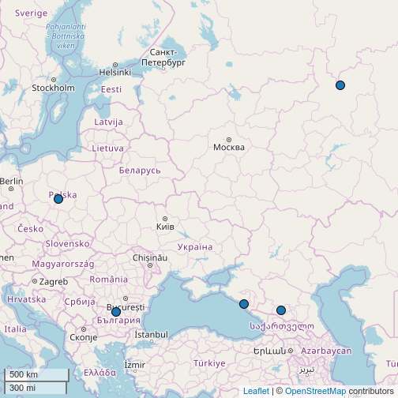

As shown in the picture above, this function generates an interactive Leaflet map. All specific points on the map have a pop-up box that appears when markers are clicked (see section 3.3 for more information about editing pop-up boxes). By default, they contain language names linked to the glottolog site.

If for some reasons you are not using RStudio or you want to automatically create and save a lot of maps, you can save a map to a variable and use the `htmlwidgets` package for saving created maps to an .html file. I would like to thank Timo Roettger for mentioning this problem.


```r
m <- map.feature(c("Adyghe", "Korean"))
# install.packages("htmlwidgets")
library(htmlwidgets)
saveWidget(m, file="TYPE_FILE_PATH/m.html")
```

There is an export button in RStudio, but for some reason it is not so easy to save a map as a .png or.jpg file using code. [Here](http://stackoverflow.com/a/34672309/6056442) is a possible solution.

### 2. Set features
The goal of this package is to allow typologists (or any other linguists) to map language features. A list of languages and correspondent features can be stored in a `data.frame` as follows:

```r
df <- data.frame(language = c("Adyghe", "Kabardian", "Polish", "Russian", "Bulgarian"),
               features = c("polysynthetic", "polysynthetic", "fusional", "fusional", "fusional"))
df
```

```
##    language      features
## 1    Adyghe polysynthetic
## 2 Kabardian polysynthetic
## 3    Polish      fusional
## 4   Russian      fusional
## 5 Bulgarian      fusional
```

Now we can draw a map:

```r
map.feature(languages = df$language,
            features = df$features)
```

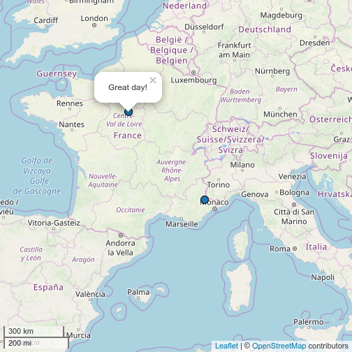

If you have a lot of features and they appear in the legend in a senseless order(by default it is ordered alphabetically), you can reorderthem using factors (a vector with ordered levels, for more information see `?factor`). for example, I want the feature polysynthetic to be listed first, followed by fusional:


```r
df$features <- factor(df$features, levels = c("polysynthetic", "fusional"))
map.feature(languages = df$language, features = df$features)
```


Like in most functions, it is not necessary to name all arguments, so the same result can be obtained by:

```r
map.feature(df$language, df$features)
```

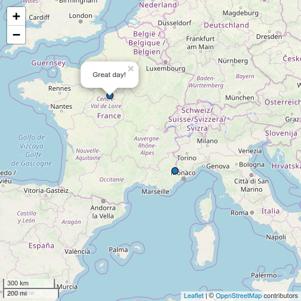

As shown in the picture above, all points are grouped by feature, colored and counted. As before, a pop-up box appears when markers are clicked. A control feature allows users to toggle the visibility of points grouped by feature.

There are several types of variables in R and `map.feature` works differently depending on the variable type. I will use a build in data set `ejective_and_n_consonants` that contains 19 languages from [UPSyD database](http://www.lapsyd.ddl.cnrs.fr/). This dataset have three variables: the categorical variable `ejectives` indicates whether some language has any ejective sound, numeric variables `consonants` and `vowels` that contains information about the number of consonants and vowels (based on UPSyD database). We can create two maps with categorical variable and with numeric variable:


```r
map.feature(ejective_and_n_consonants$language,
            ejective_and_n_consonants$ejectives) # categorical
```

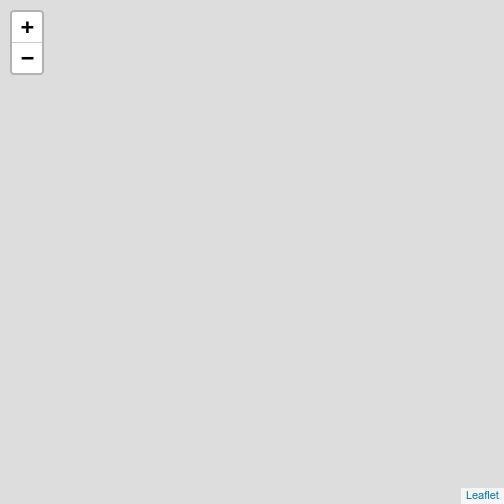

```r
map.feature(ejective_and_n_consonants$language,
            ejective_and_n_consonants$consonants) # numeric
```


The main point is that for creating a correct map, you should correctly define the type of the variable.

This dataset also can be used to show one other parameter of the `map.feature` function. There are two possible ways to show the World map: with the Atlantic sea or with the Pacific sea in the middle. If you don't need default Pacific view use the `map.orientation` parameter(thanks @languageSpaceLabs and @tzakharko for that idea):

```r
map.feature(ejective_and_n_consonants$language,
            ejective_and_n_consonants$consonants,
            map.orientation = "Atlantic")
```

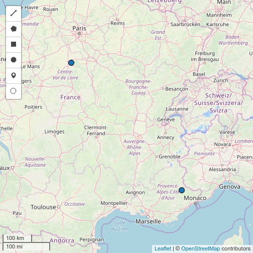

### 3. Set pop-up boxes
Sometimes it is a good idea to add some additional information (e.g. language affiliation, references or even examples) to pop-up boxes that appear when points are clicked. In order to do so, first of all we need to create an extra vector of strings in our dataframe:

```r
df$popup <- aff.lang(df$language)
```

The function `aff.lang()` creates a vector of genealogical affiliations that can be easily mapped:

```r
map.feature(languages = df$language, features = df$features, popup = df$popup)
```


Pop-up strings can contain HTML tags, so it is easy to insert a link, a couple of lines, a table or even a video and sound. Here is how pop-up boxes can demonstrate language examples:

```r
# change a df$popup vector
df$popup <- c("sɐ s-ɐ-k'ʷɐ<br> 1sg 1sg.abs-dyn-go<br>'I go'",
              "sɐ s-o-k'ʷɐ<br> 1sg 1sg.abs-dyn-go<br>'I go'",
              "id-ę<br> go-1sg.npst<br> 'I go'",
              "ya id-u<br> 1sg go-1sg.npst <br> 'I go'",
              "id-a<br> go-1sg.prs<br> 'I go'")
# create a map

map.feature(df$language,
            features = df$features,
            popup = df$popup)
```


How to say _moon_ in Sign Languages? Here is an example:

```r
# Create a dataframe with links to video
sign_df <- data.frame(languages = c("American Sign Language", "Russian Sign Language", "French Sign Language"),
                      popup = c("https://media.spreadthesign.com/video/mp4/13/48600.mp4", "https://media.spreadthesign.com/video/mp4/12/17639.mp4", "https://media.spreadthesign.com/video/mp4/10/17638.mp4"))

# Change popup to an HTML code
sign_df$popup <- paste("<video width='200' height='150' controls> <source src='",
                       as.character(sign_df$popup),
                       "' type='video/mp4'></video>", sep = "")
# create a map
map.feature(languages = sign_df$languages, popup = sign_df$popup)
```

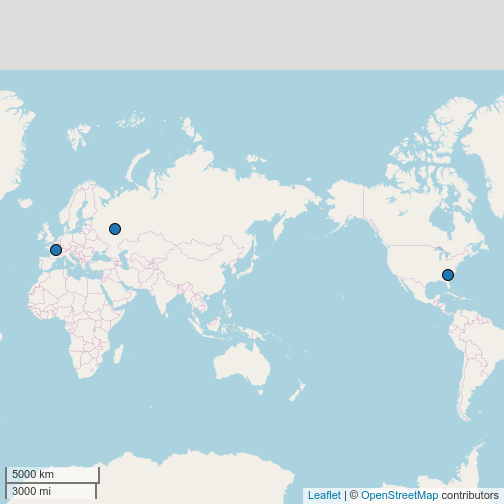

### 4. Set labels
An alternative way to add some short text to a map is to use the `label` option.

```r
map.feature(df$language, df$features,
            label = df$language)
```

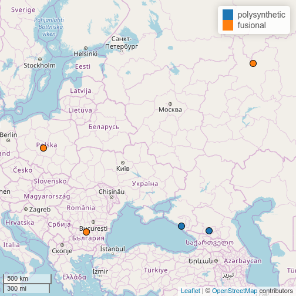

There are some additional arguments for customization: `label.fsize` for setting font size, `label.position` for controlling the label position, and `label.hide` to control the appearance of the label: if `TRUE`, the labels are displayed on mouse over(as on the previous map), if `FALSE`, the labels are always displayed (as on the next map).


```r
map.feature(df$language, df$features,
            label = df$language,
            label.fsize = 20,
            label.position = "left",
            label.hide = FALSE)
```

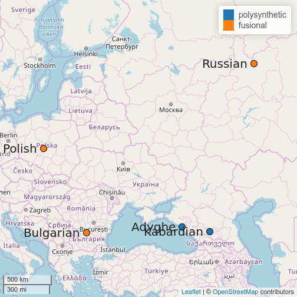

There is an additional tool for emphasis of some points on the map. The argument `label.emphasize` allows to emphasize selected points with the color specified by a user.


```r
map.feature(df$language, df$features,
            label = df$language,
            label.fsize = 20,
            label.position = "left",
            label.hide = FALSE,
            label.emphasize = list(2:4, "red"))
```

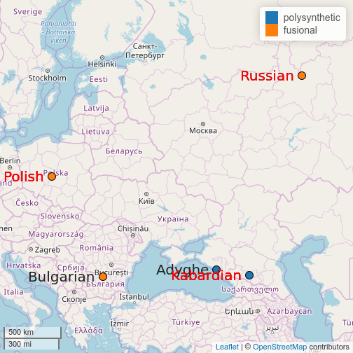

In this example the first vector of the list in the `label.emphasize` argument is vector `2:4` that produce elements `2`, `3` and `4`. You can create youro wn selected rows. e. g. `c(1, 3, 4)`. The second vector of the list is the string with a color.

### 5. Set coordinates
You can set your own coordinates using the arguments `latitude` and `longitude`. It is important to note, that `lingtypology` works only with decimal degrees (something like this: 0.1), not with degrees, minutes and seconds (something like this: 0° 06′ 0″). I will illustrate this with the dataset `circassian` built into the `lingtypology` package. This dataset comes from fieldwork collected during several expeditions in the period 2011-2016 and contains a list of Circassian villages:

```r
head(circassian)
```

```
##   latitude longitude        village district  dialect  language
## 1 45.18333  39.66667       Khatukay       ra Temirgoy    Adyghe
## 2 43.09252  43.52209       Psygansu      kbr   Baksan Kabardian
## 3 43.21775  43.73802 Verkhny Lesken      kbr   Baksan Kabardian
## 4 43.26025  43.65379       Zhemtala      kbr   Baksan Kabardian
## 5 43.31784  43.87652         Erokko      kbr   Baksan Kabardian
## 6 43.33389  43.81722       Progress      stv   Baksan Kabardian
```

In this dataframe you can find variables `latitude` and `longitude` that could be used:

```r
map.feature(languages = circassian$language,
            features = circassian$dialect,
            popup = circassian$village,
            latitude = circassian$latitude,
            longitude = circassian$longitude)
```

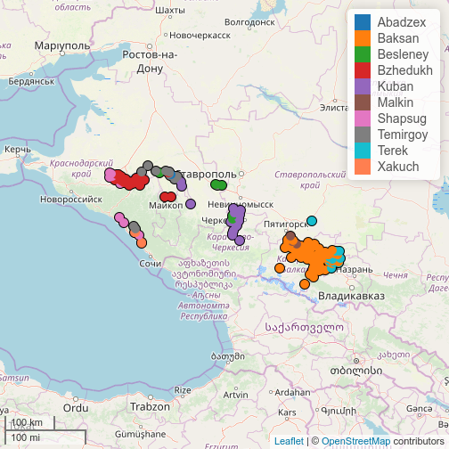

### 6. Set colors
You can set your own colors using the argument `color`:

```r
df <- data.frame(language = c("Adyghe", "Kabardian", "Polish", "Russian", "Bulgarian"),
                 features = c("polysynthetic", "polysynthetic", "fusional", "fusional", "fusional"))
map.feature(languages = df$language,
            features = df$features,
            color= c("yellowgreen", "navy"))
```

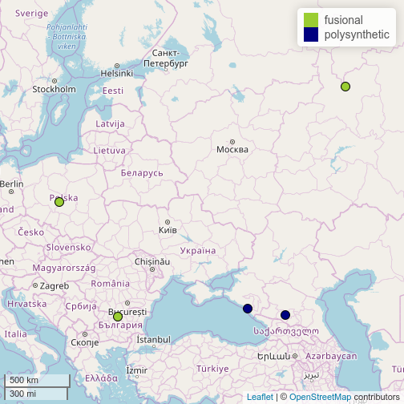

Arguments from [RColorBrewer](https://CRAN.R-project.org/package=RColorBrewer) or [viridis](https://CRAN.R-project.org/package=viridis) also can be used as a color argument:


```r
map.feature(ejective_and_n_consonants$language,
            ejective_and_n_consonants$consonants,
            color= "magma")
```

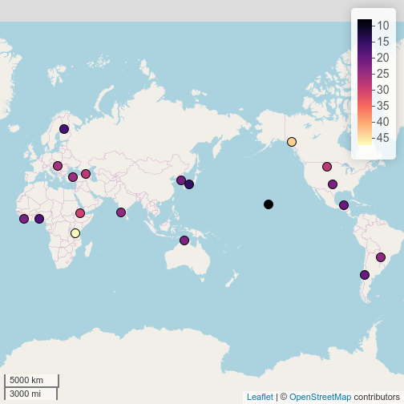

### 7. Set shapes
For some scientific papers it is not possible to use colors for destinguishing features. In that cases it is posible to use `shape` argument:


```r
map.feature(languages = circassian$language,
            features = circassian$language,
            latitude = circassian$latitude,
            longitude = circassian$longitude,
            shape = TRUE)
```

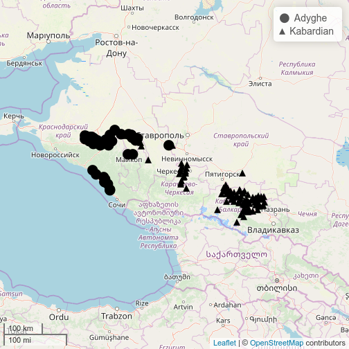

The argument `shape = TRUE` works fine only with 6 or less levels in `features` variable. If there are more levels in `fetures` argument, user need to provide a vector with corresponding shapes:


```r
map.feature(languages = circassian$language,
            features = circassian$dialect,
            latitude = circassian$latitude,
            longitude = circassian$longitude,
            shape = 1:10,
            shape.size = 14)
```

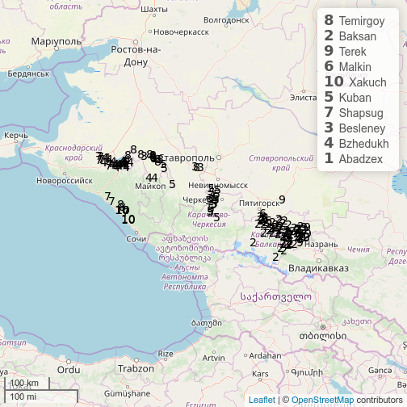

Arguments `shape.size` and `shape.color` help to change corresponding features of markers.

### 8. Set control box
The package can generate a control box that allows users to toggle the visibility of points and features. To enable it, there is an argument `control` in the `map.feature` function:


```r
map.feature(languages = df$language,
            features = df$features,
            control = TRUE)
```

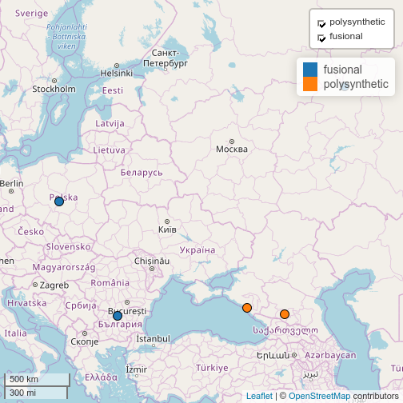

### 9. Set an additional set of features using strokes
The `map.feature` function has an additional argument `stroke.features`. Using this argument it becomes possible to show two independent sets of features on one map. By default strokes are colored in grey (so for two levels it will be black and white, for three --- black, grey, white and so on), but you can set your own colors using the argument `stroke.color`:

```r
map.feature(circassian$language,
            features = circassian$dialect,
            stroke.features = circassian$language,
            latitude = circassian$latitude,
            longitude = circassian$longitude)
```

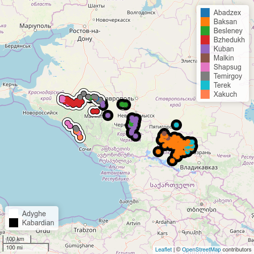

It is important to note that `stroke.features` can work with `NA` values. The function won't plot anything if there is an `NA` value. Let's set a language value to `NA` in all Baksan villages from the `circassian` dataset.


```r
# create newfeature variable
newfeature <- circassian[,c(5,6)]
# set language feature of the Baksan villages to NA and reduce newfeature from dataframe to vector
newfeature <- replace(newfeature$language, newfeature$language == "Baksan", NA)
# create a map

map.feature(circassian$language,
            features = circassian$dialect,
            latitude = circassian$latitude,
            longitude = circassian$longitude,
            stroke.features = newfeature)
```


### 10. Set width and an opacity feature
All markers have their own width and opacity, so you can set it. Just use the arguments `width`, `stroke.radius`, `opacity` and `stroke.opacity`:

```r
map.feature(circassian$language,
            features = circassian$dialect,
            stroke.features = circassian$language,
            latitude = circassian$latitude,
            longitude = circassian$longitude,
            width = 7, stroke.radius = 13)
```

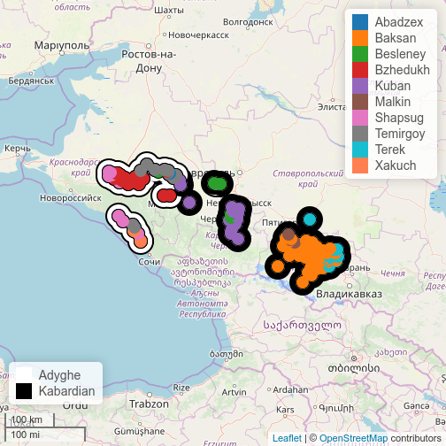

```r
map.feature(circassian$language,
            features = circassian$dialect,
            stroke.features = circassian$language,
            latitude = circassian$latitude,
            longitude = circassian$longitude,
            opacity = 0.7, stroke.opacity = 0.6)
```

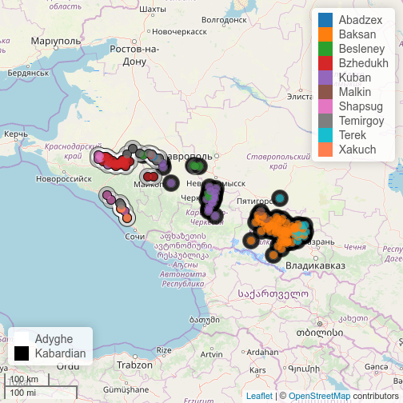

### 11. Customizing legends
By default the legend appears in the top right corner. If there are stroke features, two legends are generated. There are additional arguments that control the appearence and the title of the legends.

```r
map.feature(circassian$language,
            features = circassian$dialect,
            stroke.features = circassian$language,
            latitude = circassian$latitude,
            longitude = circassian$longitude,
            legend = FALSE, stroke.legend = TRUE)
```

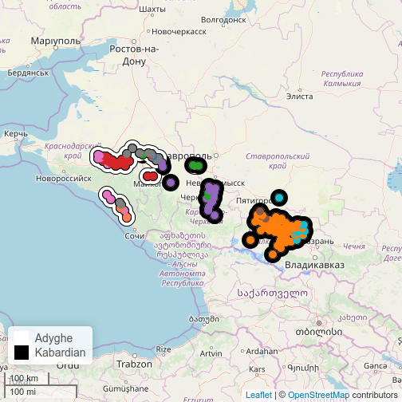

```r
map.feature(circassian$language,
            features = circassian$dialect,
            stroke.features = circassian$language,
            latitude = circassian$latitude,
            longitude = circassian$longitude,
            title = "Circassian dialects", stroke.title = "Languages")
```

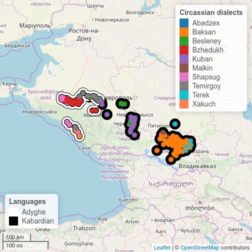
The arguments `legend.position` and `stroke.legend.position` allow you to change a legend's position using "topright", "bottomright", "bottomleft" or"topleft" strings.

### 12. Set scale bar
A scale bar is automatically added to a map, but you can control its appearance (set `scale.bar` argument to `TRUE` or`FALSE`) and its position (use `scale.bar.position` argument values "topright", "bottomright", "bottomleft" or"topleft").

```r
map.feature(c("Adyghe", "Polish", "Kabardian", "Russian"),
            scale.bar= TRUE,
            scale.bar.position = "topright")
```


### 13. Set layouts
It is possible to use different tiles on the same map using the `tile` argument. For more tiles see [here](https://leaflet-extras.github.io/leaflet-providers/preview/index.html).

```r
df <- data.frame(lang = c("Adyghe", "Kabardian", "Polish", "Russian", "Bulgarian"),
                 feature = c("polysynthetic", "polysynthetic", "fusion", "fusion", "fusion"),
                 popup = c("Adyghe", "Adyghe", "Slavic", "Slavic", "Slavic"))

map.feature(df$lang, df$feature, df$popup,
            tile = "Stamen.TonerLite")
```

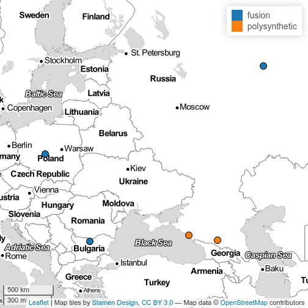

It is possible to use different map tiles on the same map. Just add a vector with tiles.

```r
df <- data.frame(lang = c("Adyghe", "Kabardian", "Polish", "Russian", "Bulgarian"),
                 feature = c("polysynthetic", "polysynthetic", "fusion", "fusion", "fusion"),
                 popup = c("Adyghe", "Adyghe", "Slavic", "Slavic", "Slavic"))

map.feature(df$lang, df$feature, df$popup,
            tile = c("Stamen.TonerLite", "Stamen.Watercolor"))
```

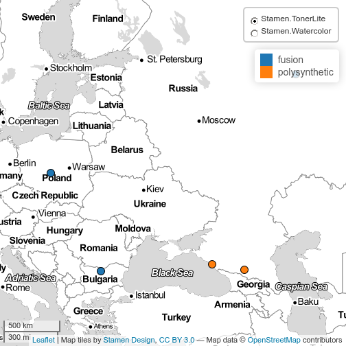

It is possible to name tiles using the `tile.name` argument.

```r
df <- data.frame(lang = c("Adyghe", "Kabardian", "Polish", "Russian", "Bulgarian"),
                 feature = c("polysynthetic", "polysynthetic", "fusion", "fusion", "fusion"),
                 popup = c("Adyghe", "Adyghe", "Slavic", "Slavic", "Slavic"))

map.feature(df$lang, df$feature, df$popup,
            tile = c("OpenStreetMap.BlackAndWhite", "Thunderforest.OpenCycleMap"),
            tile.name = c("b & w", "colored"))
```

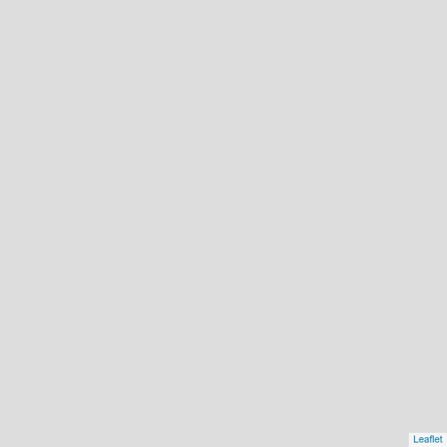

It is possible to combine the tiles' control box with the features' control box.

```r
df <- data.frame(lang = c("Adyghe", "Kabardian", "Polish", "Russian", "Bulgarian"),
                 feature = c("polysynthetic", "polysynthetic", "fusion", "fusion", "fusion"),
                 popup = c("Adyghe", "Adyghe", "Slavic", "Slavic", "Slavic"))

map.feature(df$lang, df$feature, df$popup,
            tile = c("OpenStreetMap.BlackAndWhite", "Thunderforest.OpenCycleMap"),
            control = TRUE)
```


### 14. Add a minimap to a map
It is possible to add a minimap to a map.

```r
map.feature(c("Adyghe", "Polish", "Kabardian", "Russian"),
            minimap = TRUE)
```

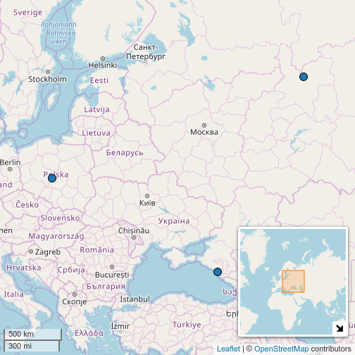

You can control its appearance (by setting the `minimap` argument to `TRUE` or `FALSE`), its position (by using the values "topright", "bottomright", "bottomleft" or"topleft" of the `minimap.position` argument) and its height and width (with the arguments `minimap.height` and `minimap.width`).

```r
map.feature(c("Adyghe", "Polish", "Kabardian", "Russian"),
            minimap = TRUE,
            minimap.position = "topright",
            minimap.height = 100,
            minimap.width = 100)
```

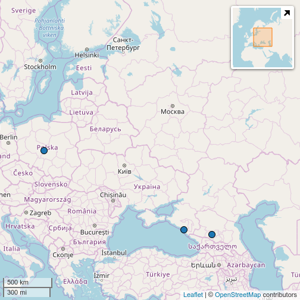

### 15. Add minicharts instead of points
This part is created using the beutifull [`leaflet.minicharts` library](https://CRAN.R-project.org/package=leaflet.minicharts). The argument `minichart` allows you to add piecharts or barplots instead of standard point markers. In this part I will use a build in data set `ejective_and_n_consonants` that contains 19 languages from [UPSyD database](http://www.lapsyd.ddl.cnrs.fr/). Here is an example of barplot:


```r
map.feature(languages = ejective_and_n_consonants$language,
            minichart.data = ejective_and_n_consonants[, c("vowels", "consonants")],
            minichart = "bar")
```

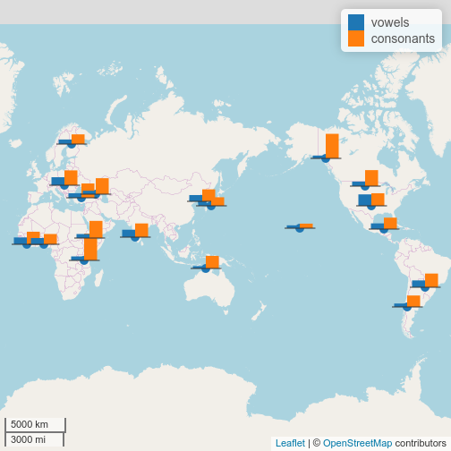

Here is an example of piechart:

```r
map.feature(languages = ejective_and_n_consonants$language,
            minichart.data = ejective_and_n_consonants[, c("vowels", "consonants")],
            minichart = "pie")
```

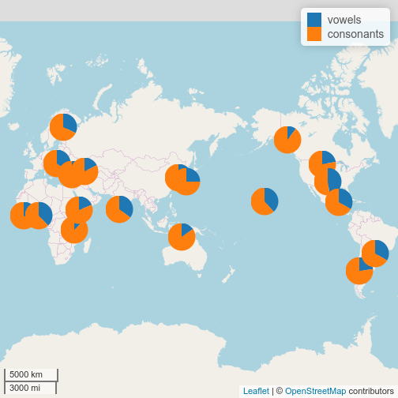

Colors and opacity could be changed, legend moved:

```r
map.feature(languages = ejective_and_n_consonants$language,
            minichart.data = ejective_and_n_consonants[, c("vowels", "consonants")],
            minichart = "bar",
            color= c("yellowgreen", "navy"),
            opacity = 0.7,
            label = ejective_and_n_consonants$language,
            legend.position = "topleft")
```

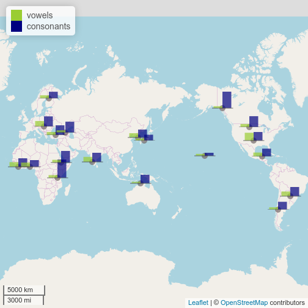

It is possible to add values using argument `minichart.labels`:

```r
map.feature(languages = ejective_and_n_consonants$language,
            minichart.data = ejective_and_n_consonants[, c("vowels", "consonants")],
            minichart = "pie",
            minichart.labels = TRUE)
```

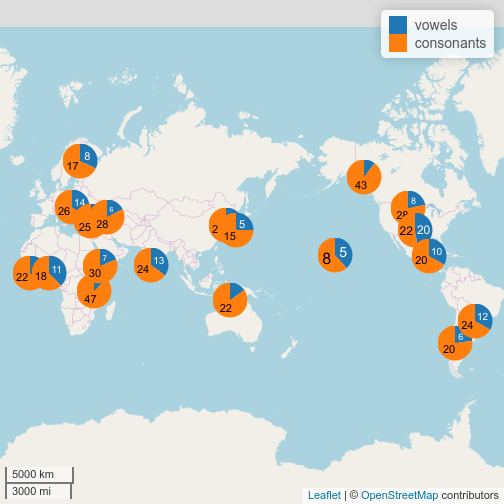

### 16. Add a rectangle to a map
It is possible to highlight some part of your map with a rectangle. You need to provide a latitude and longitude of the diagonal (`rectangle.lat` and `rectangel.lng`) and color of the rectangle (`rectangle.color`):


```r
map.feature(circassian$language,
            circassian$language,
            longitude = circassian$longitude,
            latitude = circassian$latitude,
            rectangle.lng = c(42.7, 45),
            rectangle.lat = c(42.7, 44.4),
            rectangle.color= "green")
```

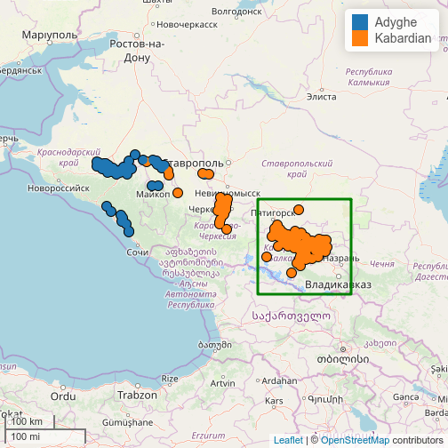

### 17. Add a density contourplot to a map
Sometimes it is easier to look at a density contourplot. It can be created using `density.estimation` argument. There are two possibility for creation a density contourplot in `lingtypology`:

* `density.method = "fixed distance"`. First algorithm creates circle polygons with fixed radius around each point and then merge all polygons that are overlapped. It has only one parameter that should be estimated: radius of the circle (`density.width`).
* `density.method = "kernal density estimation"`. Second algorithm uses a kernal density estimation and has two parameters that should be estimated: latitude and longitude bandwidths (`density.width[1]` and (`density.width[2]`))


```r
map.feature(circassian$language,
            longitude = circassian$longitude,
            latitude = circassian$latitude,
            density.estimation = circassian$language,
            density.width = 0.15)
```

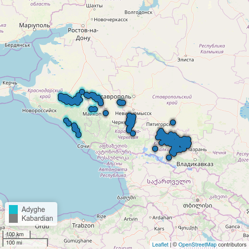

Density estimation plot can be separated by `features` variable:

```r
map.feature(circassian$language,
            features = circassian$dialect,
            longitude = circassian$longitude,
            latitude = circassian$latitude,
            density.estimation = circassian$language,
            density.width = 0.15)
```

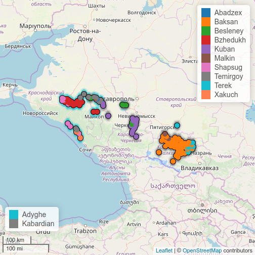

It is possible to remove points and display only the kernal density estimation plot, using the `density.points` argument:


```r
map.feature(circassian$language,
            longitude = circassian$longitude,
            latitude = circassian$latitude,
            density.estimation = circassian$language,
            density.width = 0.15,
            density.points = FALSE)
```

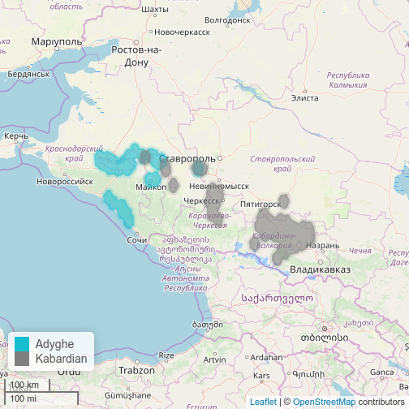

It is possible to change kernal density estimation plot opacity using the`density.estimation.opacity` argument:


```r
map.feature(circassian$language,
            longitude = circassian$longitude,
            latitude = circassian$latitude,
            density.estimation = circassian$language,
            density.width = 0.15,
            density.estimation.opacity = 0.2)
```

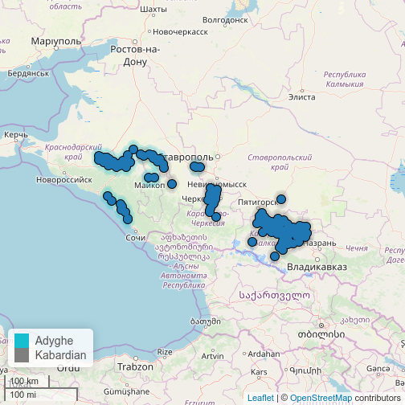

If you want to use kernal density estimation, you need to change method type and provide a vector of parameters that increase/decrease area:


```r
map.feature(circassian$language,
            features = circassian$language,
            longitude = circassian$longitude,
            latitude = circassian$latitude,
            density.estimation = "Circassian",
            density.method = "kernal density estimation",
            density.width = c(0.3, 0.3),
            color= c("darkgreen", "blue"))
```


```r
map.feature(circassian$language,
            features = circassian$language,
            longitude = circassian$longitude,
            latitude = circassian$latitude,
            density.estimation = "Circassian",
            density.method = "kernal density estimation",
            density.width = c(0.7, 0.7),
            color= c("darkgreen", "blue"))
```

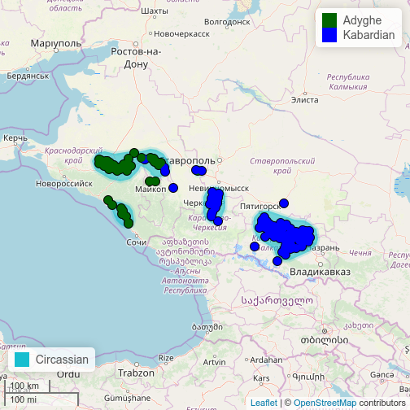

```r
map.feature(circassian$language,
            features = circassian$language,
            longitude = circassian$longitude,
            latitude = circassian$latitude,
            density.estimation = "Circassian",
            density.method = "kernal density estimation",
            density.width = c(1.3, 0.9),
            color= c("darkgreen", "blue"))
```

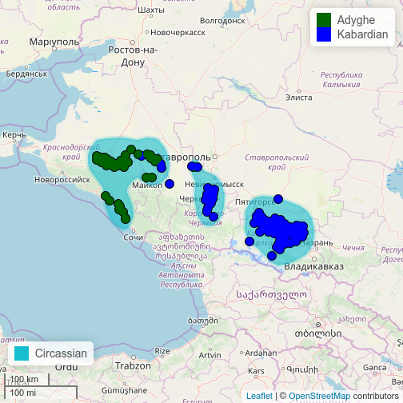

It is important to note, that this type of visualization have some shortcomings. The kernel density estimation is calculated without any adjustment, so longitude and latitude values used as a values in Cartesian coordinate system. To reduce consequences of that solution it is better to use a different coordinate projection. That allows not to treat Earth as a flat object.

### 18. Add isoglosses
It is possible to try to catch isoglosses, using the kernel density estimation algorithm. The `map.feature` argument `isogloss` recieves a dataframe with set of features:


```r
map.feature(languages = circassian$language,
            latitude = circassian$latitude,
            longitude = circassian$longitude,
            features = circassian$dialect,
            label = circassian$dialect,
            legend = TRUE,
            isogloss = as.data.frame(circassian[,"dialect"]),
            isogloss.width = 0.15)
```

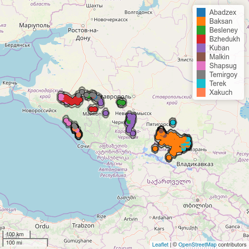

It is possible to create true isoglosses by hand, see tools for it [here](https://docs.ropensci.org/lingtypology/articles/lingtypology_dplyr.html#2_leaflet).

### 19. Add lines
It is possible to show some lines on the map using coordinates (`line.lng` and `line.lat` arguments).

```r
map.feature(circassian$language,
            features = circassian$language,
            longitude = circassian$longitude,
            latitude = circassian$latitude,
            line.lng = c(39, 43),
            line.lat = c(44.5, 43))
```

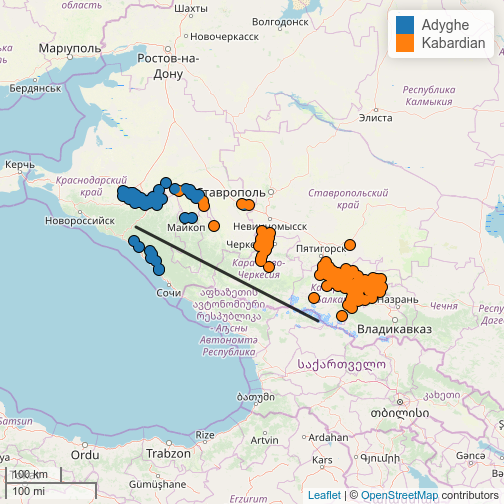

If there are more then two coordinates, multiple lines will appear. It is also possible to change the color of the line using the `line.color` argument.


```r
map.feature(circassian$language,
            features = circassian$language,
            longitude = circassian$longitude,
            latitude = circassian$latitude,
            line.lng = c(43, 39, 38.5),
            line.lat = c(43, 44.5, 45),
            line.color= "green")
```

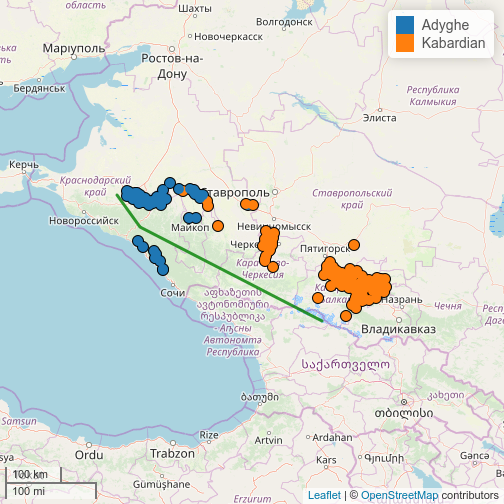

If there are two levels in the `features` variable, it is possible to draw a boundary line between point clusters (the logistic regression is used for calculation).

```r
map.feature(circassian$language,
            features = circassian$language,
            longitude = circassian$longitude,
            latitude = circassian$latitude,
            line.type = "logit")
```

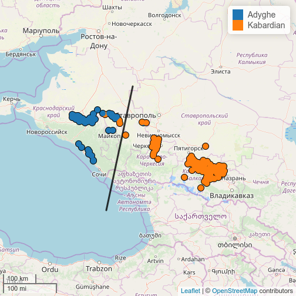

It is possible to add a graticule to a map.

```r
map.feature(c("Russian", "Adyghe"),
            graticule = 5)
```

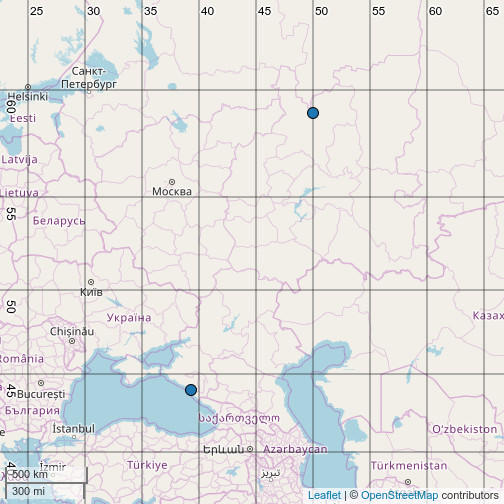
