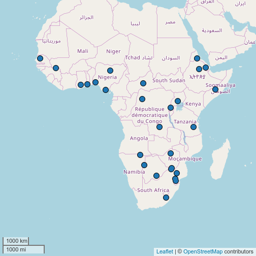

`lingtypology` provides an ability to download data from these typological databases

* [World Atlas of Language Structures](http://wals.info/)
* [AUTOTYP](https://github.com/autotyp/autotyp-data#the-autotyp-database)
* [PHOIBLE](http://phoible.org/)
* [Affix Borrowing database](http://afbo.info)
* [South American Indigenous Language Structures](http://sails.clld.org/)
* [Austronesian Basic Vocabulary Database](https://abvd.shh.mpg.de/austronesian/)

All database function names have identical structure: **database_name.feature**. All functions have as first argument `feature`. All functions create dataframe with column `language` that can be used in `map.feature()` function. It should be noted that all functions cut out the data that can't be maped, so if you want to prevent functions from this behaviour set argument `na.rm` to `FALSE`.

### 1. WALS
The names of the WALS features can be typed in a lower case. This function preserves coordinates from WALS, so you can map coordinates from the WALS or use coordinates from `lingtypology`.

```r
df <- wals.feature(c("1a", "20a"))
head(df)
```

```
##   wals.code  latitude  longitude               1a
## 1       abi -29.00000  -61.00000 Moderately small
## 2       abk  43.08333   41.00000            Large
## 3       abm  32.33333  -87.41667            Small
## 4       ach -25.25000  -55.16667            Small
## 5       acm  41.50000 -121.00000 Moderately small
## 6       aco  34.91667 -107.58333            Large
##                         20a glottocode      language
## 1 Exclusively concatenative   abip1241        Abipon
## 2 Exclusively concatenative   abkh1244        Abkhaz
## 3                      <NA>   alab1237       Alabama
## 4                      <NA>   ache1246 Ache (Tupian)
## 5                      <NA>   achu1247      Achumawi
## 6 Exclusively concatenative   west2632 Western Keres
```

```r
map.feature(df$language,
            features = df$`1a`,
            latitude = df$latitude,
            longitude = df$longitude,
            label = df$language,
            title = "Consonant Inventories")
```


### 2. AUTOTYP
The AUTOTYP features are listed on [the GitHub page](https://github.com/autotyp/autotyp-data#the-autotyp-database). You can use more human way with spaces.

```r
df <- autotyp.feature(c('Gender', 'Numeral classifiers'))
head(df)
```

```
##   LID Gender.n Gender.binned4 Gender.Presence NumClass.n NumClass.Presence
## 1   6        2      2 genders            TRUE          0             FALSE
## 2   7       NA                          FALSE          0             FALSE
## 3   9       NA                          FALSE          9              TRUE
## 4  10       NA                          FALSE          0             FALSE
## 5  12       NA                          FALSE          2              TRUE
## 6  14       NA                           TRUE          0             FALSE
##   Glottocode      language
## 1   ambu1247       Ambulas
## 2   abkh1244        Abkhaz
## 3   achi1257      Acehnese
## 4   west2632 Western Keres
## 5   ainu1240 Hokkaido Ainu
## 6   alam1246      Alamblak
```

```r
map.feature(df$language,
            features = df$NumClass.Presence,
            label = df$language,
            title = "Presence of Numeral Classifiers")
```

```
## Warning: There is no coordinates for languages Akkadian, Hittite, West !
## Xoon
```



### 3. PHOIBLE
I used only four features from PHOIBLE: the number of phonemes, the number of consonants, the number of tones and the number of vowels. If you need only a set of them, just specify it in the `features` argument. Since there is a lot of doubling information in the PHOIBLE database, there is an argument `source`.

```r
df <- phoible.feature(source = "UPSID")
head(df)
```

```
##  [1] glottocode             inventoryid            iso6393               
##  [4] specificdialect        glyphid                phoneme               
##  [7] allophones             marginal               segmentclass          
## [10] source                 tone                   stress                
## [13] syllabic               short                  long                  
## [16] consonantal            sonorant               continuant            
## [19] delayedrelease         approximant            tap                   
## [22] trill                  nasal                  lateral               
## [25] labial                 round                  labiodental           
## [28] coronal                anterior               distributed           
## [31] strident               dorsal                 high                  
## [34] low                    front                  back                  
## [37] tense                  retractedtongueroot    advancedtongueroot    
## [40] periodicglottalsource  epilaryngealsource     spreadglottis         
## [43] constrictedglottis     fortis                 raisedlarynxejective  
## [46] loweredlarynximplosive click                  language              
## <0 rows> (or 0-length row.names)
```

```r
map.feature(df$language,
            features = df$phonemes,
            label = df$language,
            title = "Number of Phonemes")
```

```
## Error in map.feature(df$language, features = df$phonemes, label = df$language, : There is no data to map
```

### 4. AfBo
The AfBo database has a lot of features that distinguish affix functions, but again you can use a bare function without any arguments to download the whole database. There will be no difference in time, since this function downloads the whole database to your PC. The main destinction is that this database provides recipient and donor languages, so other column names should be used.


```r
df <- afbo.feature(c("adjectivizer", "adverbializer"))
head(df)
```

```
##       Recipient.name     Donor.name reliability adjectivizer adverbializer
## 4              Sakha Halh Mongolian        high            4             1
## 5        Vlax Romani       Romanian        high            1            NA
## 7              Tajik Northern Uzbek         mid           NA             1
## 14 Cajamarca Quechua        Spanish        high            3            NA
## 22     Gheg Albanian        Turkish        high            1            NA
## 24      Eastern Mari        Chuvash         mid            1            NA
```

```r
map.feature(df$Recipient.name,
            features = df$adjectivizer,
            label = df$Recipient.name,
            title = "Borrowed adjectivizer affixes")
```


### 5. SAILS
The SAILS database provide a lot of [features](http://sails.clld.org/parameters), so the function work with their ids:

```r
df <- sails.feature(features = "ics10")
head(df)
```

```
##       language ics10_value ics10_description   latitude longitude
## 1      Achagua           1               Yes   4.386490 -72.20050
## 2     Apolista           1               Yes -14.830000 -68.66000
## 3      Apurina           1               Yes  -8.216920 -66.77141
## 4      Arhuaco           0                No  10.701840 -73.63629
## 5    Ashaninka           0                No -11.931090 -73.90728
## 6 Awa-Cuaiquer           0                No   1.216525 -78.34014
```

```r
map.feature(df$language,
            features = df$ics10_description,
            longitude = df$longitude,
            latitude = df$latitude,
            label = df$language,
            title = "Are there numeral classifiers?")
```


### 6. ABVD
The ABVD database is a lexical database, so it is different from clld databases. First of all, ABVD has its own language classification ids. The information about the same language from different sources can be received from these database different ids. So I select several languages and map them coloring by word with the meaning 'hand'.

```r
df <- abvd.feature(50:55)
```

```
## Error in if (skip > 0L) readLines(file, skip): missing value where TRUE/FALSE needed
```

```r
head(df)
```

```
##       language ics10_value ics10_description   latitude longitude
## 1      Achagua           1               Yes   4.386490 -72.20050
## 2     Apolista           1               Yes -14.830000 -68.66000
## 3      Apurina           1               Yes  -8.216920 -66.77141
## 4      Arhuaco           0                No  10.701840 -73.63629
## 5    Ashaninka           0                No -11.931090 -73.90728
## 6 Awa-Cuaiquer           0                No   1.216525 -78.34014
```

```r
new_df <- df[df$word == "hand",]
map.feature(new_df$language,
            features = new_df$item,
            label = new_df$language)
```

```
## Error in map.feature(new_df$language, features = new_df$item, label = new_df$language): There is no data to map
```

### 7. UraLex

`uralex.feature` downloads data from UraLex basic vocabulary dataset. Original language names are stored in the `language` variable. Converted language names for `map.feature` are stored in the `language2` variable.


```r
df <- uralex.feature()
df <- df[df$uralex_mng == "crush",]

map.feature(df$language2,
            label = df$item,
            title = "crush")
```

```
## Warning: Language Inari Sami is absent in our version of the Glottolog
## database. Did you mean Inari Saami?
```

```
## Warning: Language Kildin Sami is absent in our version of the Glottolog
## database. Did you mean Kildin Saami?
```

```
## Warning: Language Northern Sami is absent in our version of the Glottolog
## database. Did you mean Northern Pumi, Northern Pame, Northern Bai?

## Warning: Language Northern Sami is absent in our version of the Glottolog
## database. Did you mean Northern Pumi, Northern Pame, Northern Bai?
```

```
## Warning: Language Pite Sami is absent in our version of the Glottolog
## database. Did you mean Pite Saami?
```

```
## Warning: Language Skolt Sami is absent in our version of the Glottolog
## database. Did you mean Skolt Saami?
```

```
## Warning: Language Southern Sami is absent in our version of the Glottolog
## database. Did you mean Southern Sama, Southern Samo?

## Warning: Language Southern Sami is absent in our version of the Glottolog
## database. Did you mean Southern Sama, Southern Samo?
```

```
## Warning: Language Ume Sami is absent in our version of the Glottolog
## database. Did you mean Ume Saami?
```

```
## Warning: Language Voro (Uralic) is absent in our version of the Glottolog
## database. Did you mean Karo (Brazil)?

## Warning: Language Voro (Uralic) is absent in our version of the Glottolog
## database. Did you mean Karo (Brazil)?
```

```
## Warning: Language Inari Sami is absent in our version of the Glottolog
## database. Did you mean Inari Saami?
```

```
## Warning: Language Kildin Sami is absent in our version of the Glottolog
## database. Did you mean Kildin Saami?
```

```
## Warning: Language Northern Sami is absent in our version of the Glottolog
## database. Did you mean Northern Pumi, Northern Pame, Northern Bai?

## Warning: Language Northern Sami is absent in our version of the Glottolog
## database. Did you mean Northern Pumi, Northern Pame, Northern Bai?
```

```
## Warning: Language Pite Sami is absent in our version of the Glottolog
## database. Did you mean Pite Saami?
```

```
## Warning: Language Skolt Sami is absent in our version of the Glottolog
## database. Did you mean Skolt Saami?
```

```
## Warning: Language Southern Sami is absent in our version of the Glottolog
## database. Did you mean Southern Sama, Southern Samo?

## Warning: Language Southern Sami is absent in our version of the Glottolog
## database. Did you mean Southern Sama, Southern Samo?
```

```
## Warning: Language Ume Sami is absent in our version of the Glottolog
## database. Did you mean Ume Saami?
```

```
## Warning: Language Voro (Uralic) is absent in our version of the Glottolog
## database. Did you mean Karo (Brazil)?

## Warning: Language Voro (Uralic) is absent in our version of the Glottolog
## database. Did you mean Karo (Brazil)?
```

```
## Warning: Language Inari Sami is absent in our version of the Glottolog
## database. Did you mean Inari Saami?
```

```
## Warning: Language Kildin Sami is absent in our version of the Glottolog
## database. Did you mean Kildin Saami?
```

```
## Warning: Language Northern Sami is absent in our version of the Glottolog
## database. Did you mean Northern Pumi, Northern Pame, Northern Bai?

## Warning: Language Northern Sami is absent in our version of the Glottolog
## database. Did you mean Northern Pumi, Northern Pame, Northern Bai?
```

```
## Warning: Language Pite Sami is absent in our version of the Glottolog
## database. Did you mean Pite Saami?
```

```
## Warning: Language Skolt Sami is absent in our version of the Glottolog
## database. Did you mean Skolt Saami?
```

```
## Warning: Language Southern Sami is absent in our version of the Glottolog
## database. Did you mean Southern Sama, Southern Samo?

## Warning: Language Southern Sami is absent in our version of the Glottolog
## database. Did you mean Southern Sama, Southern Samo?
```

```
## Warning: Language Ume Sami is absent in our version of the Glottolog
## database. Did you mean Ume Saami?
```

```
## Warning: Language Voro (Uralic) is absent in our version of the Glottolog
## database. Did you mean Karo (Brazil)?

## Warning: Language Voro (Uralic) is absent in our version of the Glottolog
## database. Did you mean Karo (Brazil)?
```

```
## Warning: There is no coordinates for languages Inari Sami, Kildin Sami,
## Northern Sami, Northern Sami, Pite Sami, Skolt Sami, Southern Sami,
## Southern Sami, Ume Sami, Vach-Vasjugan, Voro (Uralic), Voro (Uralic)
```


