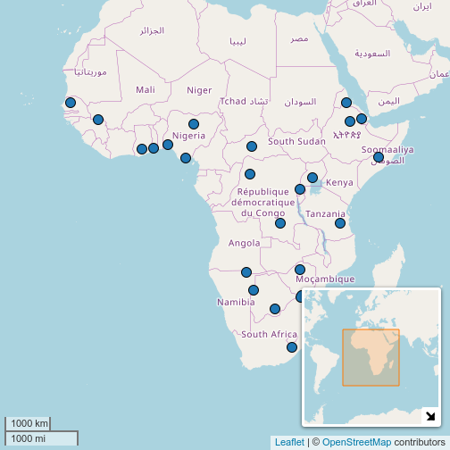
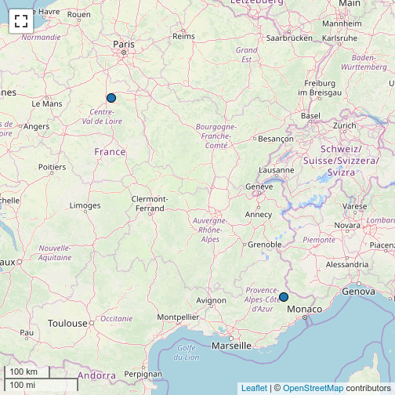

### 1. `dplyr` and `magritr` %>%

It is possible to use [`dplyr`](https://github.com/tidyverse/dplyr) functions and pipes with `lingtypology`. It is widely used, so I will give some examples, how to use it with the`lingtypology` package. Using query "list of languages csv" I found Vincent Garnier's [languages-list repository](https://github.com/forxer/languages-list). Let’s download and map all the languages from that set. First download the data:


```r
new_data <- read.csv("https://goo.gl/GgscBE")
tail(new_data)
```

```
##     X639.1 X639.2.T X639.2.B   Language.name                  Native.name
## 180    xh      xho      xho           Xhosa                     isiXhosa 
## 181    yi      yid      yid         Yiddish                        ייִדיש 
## 182    yo      yor      yor          Yoruba                       Yorùbá 
## 183    za      zha      zha  Zhuang, Chuang        Saɯ cueŋƅ, Saw cuengh 
## 184    zh      zho      chi         Chinese  中文 (Zhōngwén), 汉语, 漢語 
## 185    zu      zul      zul            Zulu                      isiZulu
```

As we see, some values of the `Language.name` variable contain more than one language name. Some of the names probably have different names in our database. Imagine that we want to map all languages from Africa. So that the following examples work correctly, use `library(dplyr)`.


```r
library(dplyr)
new_data %>%
  mutate(Language.name = gsub(pattern = " ", replacement = "", Language.name)) %>%
  filter(is.glottolog(Language.name) == TRUE) %>%
  filter(area.lang(Language.name) == "Africa") %>%
  select(Language.name) %>%
  map.feature()
```


We start with a dataframe, here a `new_data`. First we remove spaces at the end of each string. Then we check, whether the language names are in the glottolog database. Then we select only rows that contain languages of Africa. Then we select the `Language.name` variable. And the last line maps all selected languages.

By default, the values that came from the pipe are treated as the first argument of a function. But when there are some additional arguments, point sign specify what exact position should be piped to. Let’s produce the same map with a minimap.


```r
new_data %>%
  mutate(Language.name = gsub(pattern = " ", replacement = "", Language.name)) %>%
  filter(is.glottolog(Language.name) == TRUE) %>%
  filter(area.lang(Language.name) == "Africa") %>%
  select(Language.name) %>%
  map.feature(., minimap = TRUE)
```



### 2. `leaflet`, `leaflet.extras`, `mapview`, `mapedit`

There is also a possibility to use `lingtypology` with other [`leaflet`](https://github.com/rstudio/leaflet) functions (thanks to [Niko Partanen](https://github.com/nikopartanen) for the idea):


```r
library(leaflet)
map.feature(c("French", "Occitan")) %>%
  fitBounds(0, 40, 10, 50) %>%
  addPopups(2, 48, "Great day!")
```


If you add `leaflet` arguments befor `map.feature` function, you need to use argument `pipe.data = .`:


```r
leaflet() %>%
  fitBounds(0, 40, 10, 50) %>%
  addPopups(2, 48, "Great day!") %>%
  map.feature(c("French", "Occitan"), pipe.data = .)
```


The other usage of this `pipe.data` argument is to put there a variable with a `leaflet` object:


```r
m <- leaflet() %>%
  fitBounds(0, 40, 10, 50) %>%
  addPopups(2, 48, "Great day!")

map.feature(c("French", "Occitan"), pipe.data = m)
```


If you want to define tiles in `leaflet` part, you need to change tile argument in `map.feature` function, because the default value for the `tile` argument is "OpenStreetMap.Mapnik".


```r
leaflet()  %>%
  addProviderTiles("OpenStreetMap.BlackAndWhite") %>%
  fitBounds(0, 40, 10, 50) %>%
  addPopups(2, 48, "Great day!") %>%
  map.feature(c("French", "Occitan"), pipe.data = ., tile = "none")
```


It is also possible to use some tools provided by [`leaflet.extras` package](https://github.com/RCura/leaflet.extras):


```r
map.feature(c("French", "Occitan")) %>%
  leaflet.extras::addDrawToolbar()  %>%
  leaflet.extras::addStyleEditor()
```


```r
map.feature(c("French", "Occitan")) %>%
  leaflet.extras::addFullscreenControl()
```



Also there is a nice package `mapedit` that provide a possibility of creating and editing of leaflet objects by hand:

```r
map.feature(c("Adyghe", "Russian")) %>%
  mapedit::editMap() ->
  my_polygone

map.feature(c("Adyghe", "Russian")) %>%
  leaflet::addPolygons(data = my_polygone$finished)
```


### 3. Combining maps in a grid and facetisation with `mapview`

The [`mapview` package](https://github.com/r-spatial/mapview) provides a possibility to create a multiple maps in a grid and even synchronise them. There are two functions for that: `latticeview()` and `sync()`. Facetisation is a really powerfull tool (look for `facet_grid()` and `facet_wrap()` functions from `ggplot2`). `lingtypology` doesn't provide a facetisation itself, but the `facet` argument of the `map.feature()` function create a list of maps based on this variable. The result of the work of this function then is changed: instead of creating a map in Viewer pane it will return a list that could be used in `latticeview()` and `sync()` functions from the `mapview` package.


```r
faceted <- map.feature(circassian$language,
                       latitude = circassian$latitude,
                       longitude = circassian$longitude,
                       features = circassian$dialect,
                       facet = circassian$language)
library(mapview)
sync(faceted, no.initial.sync = FALSE)
```

```
## Warning: 'mapview::sync' is deprecated.
## Use 'leafsync::sync' instead.
## See help("Deprecated") and help("leafsync-deprecated").
```

```
## Warning: 'mapview::latticeView' is deprecated.
## Use 'leafsync::latticeView' instead.
## See help("Deprecated") and help("mapview-deprecated").
```

<!--html_preserve--><div style="display:inline;width:49%;float:left;border-style:solid;border-color:#BEBEBE;border-width:1px 1px 1px 1px;">
<div id="htmlwidget-6334" style="width:100%;height:400px;" class="leaflet html-widget"></div>
<script type="application/json" data-for="htmlwidget-6334">{"x":{"options":{"crs":{"crsClass":"L.CRS.EPSG3857","code":null,"proj4def":null,"projectedBounds":null,"options":{}},"zoomControl":false},"calls":[{"method":"addTiles","args":["OpenStreetMap.Mapnik",null,null,{"minZoom":0,"maxZoom":18,"tileSize":256,"subdomains":"abc","errorTileUrl":"","tms":false,"noWrap":false,"zoomOffset":0,"zoomReverse":false,"opacity":1,"zIndex":1,"detectRetina":false}]},{"method":"addProviderTiles","args":["OpenStreetMap.Mapnik",null,"OpenStreetMap.Mapnik",{"errorTileUrl":"","noWrap":false,"detectRetina":false}]},{"method":"addCircleMarkers","args":[[45.18333,43.822786,43.833917,43.968217,44.009389,44.009397,44.00941,44.075833,44.116389,44.184722,44.28361,44.631132,44.644722,44.835,44.835,44.845,44.865,44.866667,44.87391,44.874722,44.883056,44.883942,44.887778,44.892527,44.9025,44.905,44.905,44.915421,44.921111,44.9225,44.926111,44.933889,44.941667,44.946389,44.950833,44.954747,44.965,44.983056,44.987351,44.993333,44.994444,44.9975,44.999167,45.011389,45.02,45.023972,45.034167,45.045278,45.046111,45.051111,45.065556,45.068889,45.072222,45.083889,45.092222],[39.66667,39.500981,39.508069,39.447133,39.356639,39.335326,39.36232,39.3425,39.301667,39.07,38.953618,40.072682,40.225833,39.208056,41.38389,39.467778,38.988056,39.283333,39.153554,39.457778,39.383056,39.066682,39.266111,39.233689,39.174722,39.4175,39.275,39.39023,38.992778,39.382778,39.566944,38.836944,39.369444,39.41,39.114444,40.317685,39.367778,39.476111,38.715489,40.311389,39.0025,40.392222,38.781944,40.217222,40.23,38.936994,38.894722,38.756111,40.183056,38.706389,40.174167,39.4975,40.188611,39.861389,40.110278],5.5,null,["Temirgoy","Xakuch","Xakuch","Shapsug","Xakuch","Xakuch","Xakuch","Temirgoy","Temirgoy","Shapsug","Shapsug","Bzhedukh","Bzhedukh","Bzhedukh","Temirgoy","Bzhedukh","Shapsug","Bzhedukh","Bzhedukh","Bzhedukh","Bzhedukh","Bzhedukh","Bzhedukh","Bzhedukh","Bzhedukh","Bzhedukh","Bzhedukh","Bzhedukh","Bzhedukh","Bzhedukh","Bzhedukh","Bzhedukh","Bzhedukh","Bzhedukh","Bzhedukh","Temirgoy","Bzhedukh","Bzhedukh","Shapsug","Temirgoy","Bzhedukh","Temirgoy","Shapsug","Temirgoy","Abadzex","Bzhedukh","Bzhedukh","Shapsug","Temirgoy","Shapsug","Bzhedukh","Temirgoy","Temirgoy","Temirgoy","Temirgoy"],{"interactive":true,"className":"","stroke":false,"color":"black","weight":5,"opacity":0.5,"fill":true,"fillColor":"black","fillOpacity":1},null,null,["<a href='http://glottolog.org/resource/languoid/iso/ady' target='_blank'>Adyghe<\/a><br>","<a href='http://glottolog.org/resource/languoid/iso/ady' target='_blank'>Adyghe<\/a><br>","<a href='http://glottolog.org/resource/languoid/iso/ady' target='_blank'>Adyghe<\/a><br>","<a href='http://glottolog.org/resource/languoid/iso/ady' target='_blank'>Adyghe<\/a><br>","<a href='http://glottolog.org/resource/languoid/iso/ady' target='_blank'>Adyghe<\/a><br>","<a href='http://glottolog.org/resource/languoid/iso/ady' target='_blank'>Adyghe<\/a><br>","<a href='http://glottolog.org/resource/languoid/iso/ady' target='_blank'>Adyghe<\/a><br>","<a href='http://glottolog.org/resource/languoid/iso/ady' target='_blank'>Adyghe<\/a><br>","<a href='http://glottolog.org/resource/languoid/iso/ady' target='_blank'>Adyghe<\/a><br>","<a href='http://glottolog.org/resource/languoid/iso/ady' target='_blank'>Adyghe<\/a><br>","<a href='http://glottolog.org/resource/languoid/iso/ady' target='_blank'>Adyghe<\/a><br>","<a href='http://glottolog.org/resource/languoid/iso/ady' target='_blank'>Adyghe<\/a><br>","<a href='http://glottolog.org/resource/languoid/iso/ady' target='_blank'>Adyghe<\/a><br>","<a href='http://glottolog.org/resource/languoid/iso/ady' target='_blank'>Adyghe<\/a><br>","<a href='http://glottolog.org/resource/languoid/iso/ady' target='_blank'>Adyghe<\/a><br>","<a href='http://glottolog.org/resource/languoid/iso/ady' target='_blank'>Adyghe<\/a><br>","<a href='http://glottolog.org/resource/languoid/iso/ady' target='_blank'>Adyghe<\/a><br>","<a href='http://glottolog.org/resource/languoid/iso/ady' target='_blank'>Adyghe<\/a><br>","<a href='http://glottolog.org/resource/languoid/iso/ady' target='_blank'>Adyghe<\/a><br>","<a href='http://glottolog.org/resource/languoid/iso/ady' target='_blank'>Adyghe<\/a><br>","<a href='http://glottolog.org/resource/languoid/iso/ady' target='_blank'>Adyghe<\/a><br>","<a href='http://glottolog.org/resource/languoid/iso/ady' target='_blank'>Adyghe<\/a><br>","<a href='http://glottolog.org/resource/languoid/iso/ady' target='_blank'>Adyghe<\/a><br>","<a href='http://glottolog.org/resource/languoid/iso/ady' target='_blank'>Adyghe<\/a><br>","<a href='http://glottolog.org/resource/languoid/iso/ady' target='_blank'>Adyghe<\/a><br>","<a href='http://glottolog.org/resource/languoid/iso/ady' target='_blank'>Adyghe<\/a><br>","<a href='http://glottolog.org/resource/languoid/iso/ady' target='_blank'>Adyghe<\/a><br>","<a href='http://glottolog.org/resource/languoid/iso/ady' target='_blank'>Adyghe<\/a><br>","<a href='http://glottolog.org/resource/languoid/iso/ady' target='_blank'>Adyghe<\/a><br>","<a href='http://glottolog.org/resource/languoid/iso/ady' target='_blank'>Adyghe<\/a><br>","<a href='http://glottolog.org/resource/languoid/iso/ady' target='_blank'>Adyghe<\/a><br>","<a href='http://glottolog.org/resource/languoid/iso/ady' target='_blank'>Adyghe<\/a><br>","<a href='http://glottolog.org/resource/languoid/iso/ady' target='_blank'>Adyghe<\/a><br>","<a href='http://glottolog.org/resource/languoid/iso/ady' target='_blank'>Adyghe<\/a><br>","<a href='http://glottolog.org/resource/languoid/iso/ady' target='_blank'>Adyghe<\/a><br>","<a href='http://glottolog.org/resource/languoid/iso/ady' target='_blank'>Adyghe<\/a><br>","<a href='http://glottolog.org/resource/languoid/iso/ady' target='_blank'>Adyghe<\/a><br>","<a href='http://glottolog.org/resource/languoid/iso/ady' target='_blank'>Adyghe<\/a><br>","<a href='http://glottolog.org/resource/languoid/iso/ady' target='_blank'>Adyghe<\/a><br>","<a href='http://glottolog.org/resource/languoid/iso/ady' target='_blank'>Adyghe<\/a><br>","<a href='http://glottolog.org/resource/languoid/iso/ady' target='_blank'>Adyghe<\/a><br>","<a href='http://glottolog.org/resource/languoid/iso/ady' target='_blank'>Adyghe<\/a><br>","<a href='http://glottolog.org/resource/languoid/iso/ady' target='_blank'>Adyghe<\/a><br>","<a href='http://glottolog.org/resource/languoid/iso/ady' target='_blank'>Adyghe<\/a><br>","<a href='http://glottolog.org/resource/languoid/iso/ady' target='_blank'>Adyghe<\/a><br>","<a href='http://glottolog.org/resource/languoid/iso/ady' target='_blank'>Adyghe<\/a><br>","<a href='http://glottolog.org/resource/languoid/iso/ady' target='_blank'>Adyghe<\/a><br>","<a href='http://glottolog.org/resource/languoid/iso/ady' target='_blank'>Adyghe<\/a><br>","<a href='http://glottolog.org/resource/languoid/iso/ady' target='_blank'>Adyghe<\/a><br>","<a href='http://glottolog.org/resource/languoid/iso/ady' target='_blank'>Adyghe<\/a><br>","<a href='http://glottolog.org/resource/languoid/iso/ady' target='_blank'>Adyghe<\/a><br>","<a href='http://glottolog.org/resource/languoid/iso/ady' target='_blank'>Adyghe<\/a><br>","<a href='http://glottolog.org/resource/languoid/iso/ady' target='_blank'>Adyghe<\/a><br>","<a href='http://glottolog.org/resource/languoid/iso/ady' target='_blank'>Adyghe<\/a><br>","<a href='http://glottolog.org/resource/languoid/iso/ady' target='_blank'>Adyghe<\/a><br>"],null,null,{"interactive":false,"permanent":false,"direction":"auto","opacity":1,"offset":[0,0],"textsize":"10px","textOnly":false,"className":"","sticky":true},null]},{"method":"addCircleMarkers","args":[[45.18333,43.822786,43.833917,43.968217,44.009389,44.009397,44.00941,44.075833,44.116389,44.184722,44.28361,44.631132,44.644722,44.835,44.835,44.845,44.865,44.866667,44.87391,44.874722,44.883056,44.883942,44.887778,44.892527,44.9025,44.905,44.905,44.915421,44.921111,44.9225,44.926111,44.933889,44.941667,44.946389,44.950833,44.954747,44.965,44.983056,44.987351,44.993333,44.994444,44.9975,44.999167,45.011389,45.02,45.023972,45.034167,45.045278,45.046111,45.051111,45.065556,45.068889,45.072222,45.083889,45.092222],[39.66667,39.500981,39.508069,39.447133,39.356639,39.335326,39.36232,39.3425,39.301667,39.07,38.953618,40.072682,40.225833,39.208056,41.38389,39.467778,38.988056,39.283333,39.153554,39.457778,39.383056,39.066682,39.266111,39.233689,39.174722,39.4175,39.275,39.39023,38.992778,39.382778,39.566944,38.836944,39.369444,39.41,39.114444,40.317685,39.367778,39.476111,38.715489,40.311389,39.0025,40.392222,38.781944,40.217222,40.23,38.936994,38.894722,38.756111,40.183056,38.706389,40.174167,39.4975,40.188611,39.861389,40.110278],5,null,["Temirgoy","Xakuch","Xakuch","Shapsug","Xakuch","Xakuch","Xakuch","Temirgoy","Temirgoy","Shapsug","Shapsug","Bzhedukh","Bzhedukh","Bzhedukh","Temirgoy","Bzhedukh","Shapsug","Bzhedukh","Bzhedukh","Bzhedukh","Bzhedukh","Bzhedukh","Bzhedukh","Bzhedukh","Bzhedukh","Bzhedukh","Bzhedukh","Bzhedukh","Bzhedukh","Bzhedukh","Bzhedukh","Bzhedukh","Bzhedukh","Bzhedukh","Bzhedukh","Temirgoy","Bzhedukh","Bzhedukh","Shapsug","Temirgoy","Bzhedukh","Temirgoy","Shapsug","Temirgoy","Abadzex","Bzhedukh","Bzhedukh","Shapsug","Temirgoy","Shapsug","Bzhedukh","Temirgoy","Temirgoy","Temirgoy","Temirgoy"],{"interactive":true,"className":"","stroke":false,"color":["#D23239","#9467BD","#9467BD","#B16628","#9467BD","#9467BD","#9467BD","#D23239","#D23239","#B16628","#B16628","#C89119","#C89119","#C89119","#D23239","#C89119","#B16628","#C89119","#C89119","#C89119","#C89119","#C89119","#C89119","#C89119","#C89119","#C89119","#C89119","#C89119","#C89119","#C89119","#C89119","#C89119","#C89119","#C89119","#C89119","#D23239","#C89119","#C89119","#B16628","#D23239","#C89119","#D23239","#B16628","#D23239","#1F77B4","#C89119","#C89119","#B16628","#D23239","#B16628","#C89119","#D23239","#D23239","#D23239","#D23239"],"weight":5,"opacity":0.5,"fill":true,"fillColor":["#D23239","#9467BD","#9467BD","#B16628","#9467BD","#9467BD","#9467BD","#D23239","#D23239","#B16628","#B16628","#C89119","#C89119","#C89119","#D23239","#C89119","#B16628","#C89119","#C89119","#C89119","#C89119","#C89119","#C89119","#C89119","#C89119","#C89119","#C89119","#C89119","#C89119","#C89119","#C89119","#C89119","#C89119","#C89119","#C89119","#D23239","#C89119","#C89119","#B16628","#D23239","#C89119","#D23239","#B16628","#D23239","#1F77B4","#C89119","#C89119","#B16628","#D23239","#B16628","#C89119","#D23239","#D23239","#D23239","#D23239"],"fillOpacity":1},null,null,["<a href='http://glottolog.org/resource/languoid/iso/ady' target='_blank'>Adyghe<\/a><br>","<a href='http://glottolog.org/resource/languoid/iso/ady' target='_blank'>Adyghe<\/a><br>","<a href='http://glottolog.org/resource/languoid/iso/ady' target='_blank'>Adyghe<\/a><br>","<a href='http://glottolog.org/resource/languoid/iso/ady' target='_blank'>Adyghe<\/a><br>","<a href='http://glottolog.org/resource/languoid/iso/ady' target='_blank'>Adyghe<\/a><br>","<a href='http://glottolog.org/resource/languoid/iso/ady' target='_blank'>Adyghe<\/a><br>","<a href='http://glottolog.org/resource/languoid/iso/ady' target='_blank'>Adyghe<\/a><br>","<a href='http://glottolog.org/resource/languoid/iso/ady' target='_blank'>Adyghe<\/a><br>","<a href='http://glottolog.org/resource/languoid/iso/ady' target='_blank'>Adyghe<\/a><br>","<a href='http://glottolog.org/resource/languoid/iso/ady' target='_blank'>Adyghe<\/a><br>","<a href='http://glottolog.org/resource/languoid/iso/ady' target='_blank'>Adyghe<\/a><br>","<a href='http://glottolog.org/resource/languoid/iso/ady' target='_blank'>Adyghe<\/a><br>","<a href='http://glottolog.org/resource/languoid/iso/ady' target='_blank'>Adyghe<\/a><br>","<a href='http://glottolog.org/resource/languoid/iso/ady' target='_blank'>Adyghe<\/a><br>","<a href='http://glottolog.org/resource/languoid/iso/ady' target='_blank'>Adyghe<\/a><br>","<a href='http://glottolog.org/resource/languoid/iso/ady' target='_blank'>Adyghe<\/a><br>","<a href='http://glottolog.org/resource/languoid/iso/ady' target='_blank'>Adyghe<\/a><br>","<a href='http://glottolog.org/resource/languoid/iso/ady' target='_blank'>Adyghe<\/a><br>","<a href='http://glottolog.org/resource/languoid/iso/ady' target='_blank'>Adyghe<\/a><br>","<a href='http://glottolog.org/resource/languoid/iso/ady' target='_blank'>Adyghe<\/a><br>","<a href='http://glottolog.org/resource/languoid/iso/ady' target='_blank'>Adyghe<\/a><br>","<a href='http://glottolog.org/resource/languoid/iso/ady' target='_blank'>Adyghe<\/a><br>","<a href='http://glottolog.org/resource/languoid/iso/ady' target='_blank'>Adyghe<\/a><br>","<a href='http://glottolog.org/resource/languoid/iso/ady' target='_blank'>Adyghe<\/a><br>","<a href='http://glottolog.org/resource/languoid/iso/ady' target='_blank'>Adyghe<\/a><br>","<a href='http://glottolog.org/resource/languoid/iso/ady' target='_blank'>Adyghe<\/a><br>","<a href='http://glottolog.org/resource/languoid/iso/ady' target='_blank'>Adyghe<\/a><br>","<a href='http://glottolog.org/resource/languoid/iso/ady' target='_blank'>Adyghe<\/a><br>","<a href='http://glottolog.org/resource/languoid/iso/ady' target='_blank'>Adyghe<\/a><br>","<a href='http://glottolog.org/resource/languoid/iso/ady' target='_blank'>Adyghe<\/a><br>","<a href='http://glottolog.org/resource/languoid/iso/ady' target='_blank'>Adyghe<\/a><br>","<a href='http://glottolog.org/resource/languoid/iso/ady' target='_blank'>Adyghe<\/a><br>","<a href='http://glottolog.org/resource/languoid/iso/ady' target='_blank'>Adyghe<\/a><br>","<a href='http://glottolog.org/resource/languoid/iso/ady' target='_blank'>Adyghe<\/a><br>","<a href='http://glottolog.org/resource/languoid/iso/ady' target='_blank'>Adyghe<\/a><br>","<a href='http://glottolog.org/resource/languoid/iso/ady' target='_blank'>Adyghe<\/a><br>","<a href='http://glottolog.org/resource/languoid/iso/ady' target='_blank'>Adyghe<\/a><br>","<a href='http://glottolog.org/resource/languoid/iso/ady' target='_blank'>Adyghe<\/a><br>","<a href='http://glottolog.org/resource/languoid/iso/ady' target='_blank'>Adyghe<\/a><br>","<a href='http://glottolog.org/resource/languoid/iso/ady' target='_blank'>Adyghe<\/a><br>","<a href='http://glottolog.org/resource/languoid/iso/ady' target='_blank'>Adyghe<\/a><br>","<a href='http://glottolog.org/resource/languoid/iso/ady' target='_blank'>Adyghe<\/a><br>","<a href='http://glottolog.org/resource/languoid/iso/ady' target='_blank'>Adyghe<\/a><br>","<a href='http://glottolog.org/resource/languoid/iso/ady' target='_blank'>Adyghe<\/a><br>","<a href='http://glottolog.org/resource/languoid/iso/ady' target='_blank'>Adyghe<\/a><br>","<a href='http://glottolog.org/resource/languoid/iso/ady' target='_blank'>Adyghe<\/a><br>","<a href='http://glottolog.org/resource/languoid/iso/ady' target='_blank'>Adyghe<\/a><br>","<a href='http://glottolog.org/resource/languoid/iso/ady' target='_blank'>Adyghe<\/a><br>","<a href='http://glottolog.org/resource/languoid/iso/ady' target='_blank'>Adyghe<\/a><br>","<a href='http://glottolog.org/resource/languoid/iso/ady' target='_blank'>Adyghe<\/a><br>","<a href='http://glottolog.org/resource/languoid/iso/ady' target='_blank'>Adyghe<\/a><br>","<a href='http://glottolog.org/resource/languoid/iso/ady' target='_blank'>Adyghe<\/a><br>","<a href='http://glottolog.org/resource/languoid/iso/ady' target='_blank'>Adyghe<\/a><br>","<a href='http://glottolog.org/resource/languoid/iso/ady' target='_blank'>Adyghe<\/a><br>","<a href='http://glottolog.org/resource/languoid/iso/ady' target='_blank'>Adyghe<\/a><br>"],null,null,{"interactive":false,"permanent":false,"direction":"right","opacity":1,"offset":[7.5,0],"textsize":"10px","textOnly":true,"style":{"font-size":"15px","font-family":"sans-serif"},"className":"","sticky":true},null]},{"method":"addScaleBar","args":[{"maxWidth":100,"metric":true,"imperial":true,"updateWhenIdle":true,"position":"bottomleft"}]},{"method":"addLegend","args":[{"colors":["#1F77B4","#C89119","#B16628","#D23239","#9467BD"],"labels":["Abadzex","Bzhedukh","Shapsug","Temirgoy","Xakuch"],"na_color":null,"na_label":"NA","opacity":1,"position":"topright","type":"factor","title":"Adyghe ","extra":null,"layerId":null,"className":"info legend","group":null}]}],"limits":{"lat":[43.822786,45.18333],"lng":[38.706389,41.38389]}},"evals":[],"jsHooks":[]}</script>
</div>
<div style="display:inline;width:49%;float:left;border-style:solid;border-color:#BEBEBE;border-width:1px 1px 1px 1px;">
<div id="htmlwidget-3176" style="width:100%;height:400px;" class="leaflet html-widget"></div>
<script type="application/json" data-for="htmlwidget-3176">{"x":{"options":{"crs":{"crsClass":"L.CRS.EPSG3857","code":null,"proj4def":null,"projectedBounds":null,"options":{}},"zoomControl":false},"calls":[{"method":"addTiles","args":["OpenStreetMap.Mapnik",null,null,{"minZoom":0,"maxZoom":18,"tileSize":256,"subdomains":"abc","errorTileUrl":"","tms":false,"noWrap":false,"zoomOffset":0,"zoomReverse":false,"opacity":1,"zIndex":1,"detectRetina":false}]},{"method":"addProviderTiles","args":["OpenStreetMap.Mapnik",null,"OpenStreetMap.Mapnik",{"errorTileUrl":"","noWrap":false,"detectRetina":false}]},{"method":"addCircleMarkers","args":[[43.0925184,43.2177484,43.2602459,43.3178415,43.33389,43.3423158,43.3434394,43.3480839,43.3506587,43.380478,43.3807323,43.3933553,43.4118144,43.4535606,43.4662834,43.4677348,43.47468,43.4778111,43.4781181,43.4855758,43.4991098,43.5039956,43.5059194,43.52444,43.5254017,43.5265677,43.5385977,43.5405887,43.5434888,43.5528175,43.55417,43.5573675,43.5577039,43.5612695,43.5665554,43.5678968,43.5701144,43.5780738,43.6033238,43.6055277,43.60694,43.6101972,43.6147962,43.6157546,43.6197557,43.6295975,43.63194,43.63722,43.6464595,43.6489847,43.649167,43.6612534,43.6655922,43.6708678,43.6710761,43.6727795,43.6741209,43.68528,43.6937577,43.6979041,43.7225969,43.722931,43.7341489,43.7403259,43.7441546,43.7574704,43.7768461,43.7773855,43.7987115,43.7999498,43.8022258,43.8034456,43.8229374,43.835631,43.8366461,43.8416125,43.8512293,43.8602847,43.863056,43.8788349,43.9468945,43.959349,43.988333,44.042366,44.115278,44.139951,44.1984238,44.206622,44.2125,44.221558,44.246111,44.253272,44.300777,44.331111,44.350776,44.400833,44.431293,44.519722,44.821667,44.839167,44.86152,44.9,45.054167],[43.5220851,43.7380201,43.6537882,43.876519,43.81722,43.9127396,44.0255211,43.7279879,43.9103428,42.9074849,44.1908915,43.7422799,43.9045102,44.2119773,43.8366936,44.3730212,44.2423294,44.123883,43.7606476,44.3636557,44.1512948,43.7185553,44.2144826,43.93194,44.209298,43.6027046,43.9317439,43.8943217,44.4137575,43.7974629,44.09972,43.1949731,43.437182,43.6042641,43.884179,43.8415817,44.1403481,43.7589165,43.9948064,43.6106262,43.83417,43.3469916,44.3515401,44.0926551,44.1305288,44.1436978,44.26917,44.12444,43.4030838,43.6384818,44.155556,43.4203399,44.025223,43.4982674,44.3740591,44.2973614,43.5178739,43.66667,43.2767476,44.2133042,43.8850094,43.5216499,43.0370284,43.1932675,43.3510112,43.7156896,43.2600149,43.4442485,43.6393754,43.3276187,43.1460561,43.7706143,43.1114348,43.1531165,43.6079187,43.2063942,43.2292012,43.2514048,41.913472,43.1074819,43.1721222,41.743847,41.738889,41.764098,41.828056,41.853875,41.6999648,41.87764,43.7,41.899453,41.741389,41.900047,41.742693,41.934722,41.801334,41.935,41.763092,40.710278,40.501667,41.486111,41.335,40.483,39.946389],5.5,null,["Baksan","Baksan","Baksan","Baksan","Baksan","Baksan","Baksan","Baksan","Baksan","Baksan","Terek","Baksan","Baksan","Baksan","Baksan","Terek","Terek","Baksan","Baksan","Baksan","Terek","Baksan","Baksan","Baksan","Terek","Baksan","Baksan","Baksan","Terek","Baksan","Baksan","Baksan","Baksan","Baksan","Baksan","Baksan","Terek","Baksan","Baksan","Baksan","Baksan","Baksan","Baksan","Baksan","Baksan","Baksan","Baksan","Baksan","Baksan","Baksan","Baksan","Baksan","Baksan","Baksan","Terek","Terek","Baksan","Baksan","Baksan","Baksan","Baksan","Baksan","Baksan","Baksan","Baksan","Baksan","Baksan","Baksan","Baksan","Malkin","Baksan","Baksan","Baksan","Baksan","Baksan","Baksan","Malkin","Baksan","Kuban","Baksan","Malkin","Kuban","Kuban","Kuban","Kuban","Kuban","Kuban","Kuban","Terek","Kuban","Besleney","Kuban","Besleney","Kuban","Kuban","Kuban","Kuban","Kuban","Kuban","Besleney","Besleney","Kuban","Besleney"],{"interactive":true,"className":"","stroke":false,"color":"black","weight":5,"opacity":0.5,"fill":true,"fillColor":"black","fillOpacity":1},null,null,["<a href='http://glottolog.org/resource/languoid/iso/kbd' target='_blank'>Kabardian<\/a><br>","<a href='http://glottolog.org/resource/languoid/iso/kbd' target='_blank'>Kabardian<\/a><br>","<a href='http://glottolog.org/resource/languoid/iso/kbd' target='_blank'>Kabardian<\/a><br>","<a href='http://glottolog.org/resource/languoid/iso/kbd' target='_blank'>Kabardian<\/a><br>","<a href='http://glottolog.org/resource/languoid/iso/kbd' target='_blank'>Kabardian<\/a><br>","<a href='http://glottolog.org/resource/languoid/iso/kbd' target='_blank'>Kabardian<\/a><br>","<a href='http://glottolog.org/resource/languoid/iso/kbd' target='_blank'>Kabardian<\/a><br>","<a href='http://glottolog.org/resource/languoid/iso/kbd' target='_blank'>Kabardian<\/a><br>","<a href='http://glottolog.org/resource/languoid/iso/kbd' target='_blank'>Kabardian<\/a><br>","<a href='http://glottolog.org/resource/languoid/iso/kbd' target='_blank'>Kabardian<\/a><br>","<a href='http://glottolog.org/resource/languoid/iso/kbd' target='_blank'>Kabardian<\/a><br>","<a href='http://glottolog.org/resource/languoid/iso/kbd' target='_blank'>Kabardian<\/a><br>","<a href='http://glottolog.org/resource/languoid/iso/kbd' target='_blank'>Kabardian<\/a><br>","<a href='http://glottolog.org/resource/languoid/iso/kbd' target='_blank'>Kabardian<\/a><br>","<a href='http://glottolog.org/resource/languoid/iso/kbd' target='_blank'>Kabardian<\/a><br>","<a href='http://glottolog.org/resource/languoid/iso/kbd' target='_blank'>Kabardian<\/a><br>","<a href='http://glottolog.org/resource/languoid/iso/kbd' target='_blank'>Kabardian<\/a><br>","<a href='http://glottolog.org/resource/languoid/iso/kbd' target='_blank'>Kabardian<\/a><br>","<a href='http://glottolog.org/resource/languoid/iso/kbd' target='_blank'>Kabardian<\/a><br>","<a href='http://glottolog.org/resource/languoid/iso/kbd' target='_blank'>Kabardian<\/a><br>","<a href='http://glottolog.org/resource/languoid/iso/kbd' target='_blank'>Kabardian<\/a><br>","<a href='http://glottolog.org/resource/languoid/iso/kbd' target='_blank'>Kabardian<\/a><br>","<a href='http://glottolog.org/resource/languoid/iso/kbd' target='_blank'>Kabardian<\/a><br>","<a href='http://glottolog.org/resource/languoid/iso/kbd' target='_blank'>Kabardian<\/a><br>","<a href='http://glottolog.org/resource/languoid/iso/kbd' target='_blank'>Kabardian<\/a><br>","<a href='http://glottolog.org/resource/languoid/iso/kbd' target='_blank'>Kabardian<\/a><br>","<a href='http://glottolog.org/resource/languoid/iso/kbd' target='_blank'>Kabardian<\/a><br>","<a href='http://glottolog.org/resource/languoid/iso/kbd' target='_blank'>Kabardian<\/a><br>","<a href='http://glottolog.org/resource/languoid/iso/kbd' target='_blank'>Kabardian<\/a><br>","<a href='http://glottolog.org/resource/languoid/iso/kbd' target='_blank'>Kabardian<\/a><br>","<a href='http://glottolog.org/resource/languoid/iso/kbd' target='_blank'>Kabardian<\/a><br>","<a href='http://glottolog.org/resource/languoid/iso/kbd' target='_blank'>Kabardian<\/a><br>","<a href='http://glottolog.org/resource/languoid/iso/kbd' target='_blank'>Kabardian<\/a><br>","<a href='http://glottolog.org/resource/languoid/iso/kbd' target='_blank'>Kabardian<\/a><br>","<a href='http://glottolog.org/resource/languoid/iso/kbd' target='_blank'>Kabardian<\/a><br>","<a href='http://glottolog.org/resource/languoid/iso/kbd' target='_blank'>Kabardian<\/a><br>","<a href='http://glottolog.org/resource/languoid/iso/kbd' target='_blank'>Kabardian<\/a><br>","<a href='http://glottolog.org/resource/languoid/iso/kbd' target='_blank'>Kabardian<\/a><br>","<a href='http://glottolog.org/resource/languoid/iso/kbd' target='_blank'>Kabardian<\/a><br>","<a href='http://glottolog.org/resource/languoid/iso/kbd' target='_blank'>Kabardian<\/a><br>","<a href='http://glottolog.org/resource/languoid/iso/kbd' target='_blank'>Kabardian<\/a><br>","<a href='http://glottolog.org/resource/languoid/iso/kbd' target='_blank'>Kabardian<\/a><br>","<a href='http://glottolog.org/resource/languoid/iso/kbd' target='_blank'>Kabardian<\/a><br>","<a href='http://glottolog.org/resource/languoid/iso/kbd' target='_blank'>Kabardian<\/a><br>","<a href='http://glottolog.org/resource/languoid/iso/kbd' target='_blank'>Kabardian<\/a><br>","<a href='http://glottolog.org/resource/languoid/iso/kbd' target='_blank'>Kabardian<\/a><br>","<a href='http://glottolog.org/resource/languoid/iso/kbd' target='_blank'>Kabardian<\/a><br>","<a href='http://glottolog.org/resource/languoid/iso/kbd' target='_blank'>Kabardian<\/a><br>","<a href='http://glottolog.org/resource/languoid/iso/kbd' target='_blank'>Kabardian<\/a><br>","<a href='http://glottolog.org/resource/languoid/iso/kbd' target='_blank'>Kabardian<\/a><br>","<a href='http://glottolog.org/resource/languoid/iso/kbd' target='_blank'>Kabardian<\/a><br>","<a href='http://glottolog.org/resource/languoid/iso/kbd' target='_blank'>Kabardian<\/a><br>","<a href='http://glottolog.org/resource/languoid/iso/kbd' target='_blank'>Kabardian<\/a><br>","<a href='http://glottolog.org/resource/languoid/iso/kbd' target='_blank'>Kabardian<\/a><br>","<a href='http://glottolog.org/resource/languoid/iso/kbd' target='_blank'>Kabardian<\/a><br>","<a href='http://glottolog.org/resource/languoid/iso/kbd' target='_blank'>Kabardian<\/a><br>","<a href='http://glottolog.org/resource/languoid/iso/kbd' target='_blank'>Kabardian<\/a><br>","<a href='http://glottolog.org/resource/languoid/iso/kbd' target='_blank'>Kabardian<\/a><br>","<a href='http://glottolog.org/resource/languoid/iso/kbd' target='_blank'>Kabardian<\/a><br>","<a href='http://glottolog.org/resource/languoid/iso/kbd' target='_blank'>Kabardian<\/a><br>","<a href='http://glottolog.org/resource/languoid/iso/kbd' target='_blank'>Kabardian<\/a><br>","<a href='http://glottolog.org/resource/languoid/iso/kbd' target='_blank'>Kabardian<\/a><br>","<a href='http://glottolog.org/resource/languoid/iso/kbd' target='_blank'>Kabardian<\/a><br>","<a href='http://glottolog.org/resource/languoid/iso/kbd' target='_blank'>Kabardian<\/a><br>","<a href='http://glottolog.org/resource/languoid/iso/kbd' target='_blank'>Kabardian<\/a><br>","<a href='http://glottolog.org/resource/languoid/iso/kbd' target='_blank'>Kabardian<\/a><br>","<a href='http://glottolog.org/resource/languoid/iso/kbd' target='_blank'>Kabardian<\/a><br>","<a href='http://glottolog.org/resource/languoid/iso/kbd' target='_blank'>Kabardian<\/a><br>","<a href='http://glottolog.org/resource/languoid/iso/kbd' target='_blank'>Kabardian<\/a><br>","<a href='http://glottolog.org/resource/languoid/iso/kbd' target='_blank'>Kabardian<\/a><br>","<a href='http://glottolog.org/resource/languoid/iso/kbd' target='_blank'>Kabardian<\/a><br>","<a href='http://glottolog.org/resource/languoid/iso/kbd' target='_blank'>Kabardian<\/a><br>","<a href='http://glottolog.org/resource/languoid/iso/kbd' target='_blank'>Kabardian<\/a><br>","<a href='http://glottolog.org/resource/languoid/iso/kbd' target='_blank'>Kabardian<\/a><br>","<a href='http://glottolog.org/resource/languoid/iso/kbd' target='_blank'>Kabardian<\/a><br>","<a href='http://glottolog.org/resource/languoid/iso/kbd' target='_blank'>Kabardian<\/a><br>","<a href='http://glottolog.org/resource/languoid/iso/kbd' target='_blank'>Kabardian<\/a><br>","<a href='http://glottolog.org/resource/languoid/iso/kbd' target='_blank'>Kabardian<\/a><br>","<a href='http://glottolog.org/resource/languoid/iso/kbd' target='_blank'>Kabardian<\/a><br>","<a href='http://glottolog.org/resource/languoid/iso/kbd' target='_blank'>Kabardian<\/a><br>","<a href='http://glottolog.org/resource/languoid/iso/kbd' target='_blank'>Kabardian<\/a><br>","<a href='http://glottolog.org/resource/languoid/iso/kbd' target='_blank'>Kabardian<\/a><br>","<a href='http://glottolog.org/resource/languoid/iso/kbd' target='_blank'>Kabardian<\/a><br>","<a href='http://glottolog.org/resource/languoid/iso/kbd' target='_blank'>Kabardian<\/a><br>","<a href='http://glottolog.org/resource/languoid/iso/kbd' target='_blank'>Kabardian<\/a><br>","<a href='http://glottolog.org/resource/languoid/iso/kbd' target='_blank'>Kabardian<\/a><br>","<a href='http://glottolog.org/resource/languoid/iso/kbd' target='_blank'>Kabardian<\/a><br>","<a href='http://glottolog.org/resource/languoid/iso/kbd' target='_blank'>Kabardian<\/a><br>","<a href='http://glottolog.org/resource/languoid/iso/kbd' target='_blank'>Kabardian<\/a><br>","<a href='http://glottolog.org/resource/languoid/iso/kbd' target='_blank'>Kabardian<\/a><br>","<a href='http://glottolog.org/resource/languoid/iso/kbd' target='_blank'>Kabardian<\/a><br>","<a href='http://glottolog.org/resource/languoid/iso/kbd' target='_blank'>Kabardian<\/a><br>","<a href='http://glottolog.org/resource/languoid/iso/kbd' target='_blank'>Kabardian<\/a><br>","<a href='http://glottolog.org/resource/languoid/iso/kbd' target='_blank'>Kabardian<\/a><br>","<a href='http://glottolog.org/resource/languoid/iso/kbd' target='_blank'>Kabardian<\/a><br>","<a href='http://glottolog.org/resource/languoid/iso/kbd' target='_blank'>Kabardian<\/a><br>","<a href='http://glottolog.org/resource/languoid/iso/kbd' target='_blank'>Kabardian<\/a><br>","<a href='http://glottolog.org/resource/languoid/iso/kbd' target='_blank'>Kabardian<\/a><br>","<a href='http://glottolog.org/resource/languoid/iso/kbd' target='_blank'>Kabardian<\/a><br>","<a href='http://glottolog.org/resource/languoid/iso/kbd' target='_blank'>Kabardian<\/a><br>","<a href='http://glottolog.org/resource/languoid/iso/kbd' target='_blank'>Kabardian<\/a><br>","<a href='http://glottolog.org/resource/languoid/iso/kbd' target='_blank'>Kabardian<\/a><br>","<a href='http://glottolog.org/resource/languoid/iso/kbd' target='_blank'>Kabardian<\/a><br>"],null,null,{"interactive":false,"permanent":false,"direction":"auto","opacity":1,"offset":[0,0],"textsize":"10px","textOnly":false,"className":"","sticky":true},null]},{"method":"addCircleMarkers","args":[[43.0925184,43.2177484,43.2602459,43.3178415,43.33389,43.3423158,43.3434394,43.3480839,43.3506587,43.380478,43.3807323,43.3933553,43.4118144,43.4535606,43.4662834,43.4677348,43.47468,43.4778111,43.4781181,43.4855758,43.4991098,43.5039956,43.5059194,43.52444,43.5254017,43.5265677,43.5385977,43.5405887,43.5434888,43.5528175,43.55417,43.5573675,43.5577039,43.5612695,43.5665554,43.5678968,43.5701144,43.5780738,43.6033238,43.6055277,43.60694,43.6101972,43.6147962,43.6157546,43.6197557,43.6295975,43.63194,43.63722,43.6464595,43.6489847,43.649167,43.6612534,43.6655922,43.6708678,43.6710761,43.6727795,43.6741209,43.68528,43.6937577,43.6979041,43.7225969,43.722931,43.7341489,43.7403259,43.7441546,43.7574704,43.7768461,43.7773855,43.7987115,43.7999498,43.8022258,43.8034456,43.8229374,43.835631,43.8366461,43.8416125,43.8512293,43.8602847,43.863056,43.8788349,43.9468945,43.959349,43.988333,44.042366,44.115278,44.139951,44.1984238,44.206622,44.2125,44.221558,44.246111,44.253272,44.300777,44.331111,44.350776,44.400833,44.431293,44.519722,44.821667,44.839167,44.86152,44.9,45.054167],[43.5220851,43.7380201,43.6537882,43.876519,43.81722,43.9127396,44.0255211,43.7279879,43.9103428,42.9074849,44.1908915,43.7422799,43.9045102,44.2119773,43.8366936,44.3730212,44.2423294,44.123883,43.7606476,44.3636557,44.1512948,43.7185553,44.2144826,43.93194,44.209298,43.6027046,43.9317439,43.8943217,44.4137575,43.7974629,44.09972,43.1949731,43.437182,43.6042641,43.884179,43.8415817,44.1403481,43.7589165,43.9948064,43.6106262,43.83417,43.3469916,44.3515401,44.0926551,44.1305288,44.1436978,44.26917,44.12444,43.4030838,43.6384818,44.155556,43.4203399,44.025223,43.4982674,44.3740591,44.2973614,43.5178739,43.66667,43.2767476,44.2133042,43.8850094,43.5216499,43.0370284,43.1932675,43.3510112,43.7156896,43.2600149,43.4442485,43.6393754,43.3276187,43.1460561,43.7706143,43.1114348,43.1531165,43.6079187,43.2063942,43.2292012,43.2514048,41.913472,43.1074819,43.1721222,41.743847,41.738889,41.764098,41.828056,41.853875,41.6999648,41.87764,43.7,41.899453,41.741389,41.900047,41.742693,41.934722,41.801334,41.935,41.763092,40.710278,40.501667,41.486111,41.335,40.483,39.946389],5,null,["Baksan","Baksan","Baksan","Baksan","Baksan","Baksan","Baksan","Baksan","Baksan","Baksan","Terek","Baksan","Baksan","Baksan","Baksan","Terek","Terek","Baksan","Baksan","Baksan","Terek","Baksan","Baksan","Baksan","Terek","Baksan","Baksan","Baksan","Terek","Baksan","Baksan","Baksan","Baksan","Baksan","Baksan","Baksan","Terek","Baksan","Baksan","Baksan","Baksan","Baksan","Baksan","Baksan","Baksan","Baksan","Baksan","Baksan","Baksan","Baksan","Baksan","Baksan","Baksan","Baksan","Terek","Terek","Baksan","Baksan","Baksan","Baksan","Baksan","Baksan","Baksan","Baksan","Baksan","Baksan","Baksan","Baksan","Baksan","Malkin","Baksan","Baksan","Baksan","Baksan","Baksan","Baksan","Malkin","Baksan","Kuban","Baksan","Malkin","Kuban","Kuban","Kuban","Kuban","Kuban","Kuban","Kuban","Terek","Kuban","Besleney","Kuban","Besleney","Kuban","Kuban","Kuban","Kuban","Kuban","Kuban","Besleney","Besleney","Kuban","Besleney"],{"interactive":true,"className":"","stroke":false,"color":["#AB7C76","#AB7C76","#AB7C76","#AB7C76","#AB7C76","#AB7C76","#AB7C76","#AB7C76","#AB7C76","#AB7C76","#BD507A","#AB7C76","#AB7C76","#AB7C76","#AB7C76","#BD507A","#BD507A","#AB7C76","#AB7C76","#AB7C76","#BD507A","#AB7C76","#AB7C76","#AB7C76","#BD507A","#AB7C76","#AB7C76","#AB7C76","#BD507A","#AB7C76","#AB7C76","#AB7C76","#AB7C76","#AB7C76","#AB7C76","#AB7C76","#BD507A","#AB7C76","#AB7C76","#AB7C76","#AB7C76","#AB7C76","#AB7C76","#AB7C76","#AB7C76","#AB7C76","#AB7C76","#AB7C76","#AB7C76","#AB7C76","#AB7C76","#AB7C76","#AB7C76","#AB7C76","#BD507A","#BD507A","#AB7C76","#AB7C76","#AB7C76","#AB7C76","#AB7C76","#AB7C76","#AB7C76","#AB7C76","#AB7C76","#AB7C76","#AB7C76","#AB7C76","#AB7C76","#6E902A","#AB7C76","#AB7C76","#AB7C76","#AB7C76","#AB7C76","#AB7C76","#6E902A","#AB7C76","#729D26","#AB7C76","#6E902A","#729D26","#729D26","#729D26","#729D26","#729D26","#729D26","#729D26","#BD507A","#729D26","#F07F2F","#729D26","#F07F2F","#729D26","#729D26","#729D26","#729D26","#729D26","#729D26","#F07F2F","#F07F2F","#729D26","#F07F2F"],"weight":5,"opacity":0.5,"fill":true,"fillColor":["#AB7C76","#AB7C76","#AB7C76","#AB7C76","#AB7C76","#AB7C76","#AB7C76","#AB7C76","#AB7C76","#AB7C76","#BD507A","#AB7C76","#AB7C76","#AB7C76","#AB7C76","#BD507A","#BD507A","#AB7C76","#AB7C76","#AB7C76","#BD507A","#AB7C76","#AB7C76","#AB7C76","#BD507A","#AB7C76","#AB7C76","#AB7C76","#BD507A","#AB7C76","#AB7C76","#AB7C76","#AB7C76","#AB7C76","#AB7C76","#AB7C76","#BD507A","#AB7C76","#AB7C76","#AB7C76","#AB7C76","#AB7C76","#AB7C76","#AB7C76","#AB7C76","#AB7C76","#AB7C76","#AB7C76","#AB7C76","#AB7C76","#AB7C76","#AB7C76","#AB7C76","#AB7C76","#BD507A","#BD507A","#AB7C76","#AB7C76","#AB7C76","#AB7C76","#AB7C76","#AB7C76","#AB7C76","#AB7C76","#AB7C76","#AB7C76","#AB7C76","#AB7C76","#AB7C76","#6E902A","#AB7C76","#AB7C76","#AB7C76","#AB7C76","#AB7C76","#AB7C76","#6E902A","#AB7C76","#729D26","#AB7C76","#6E902A","#729D26","#729D26","#729D26","#729D26","#729D26","#729D26","#729D26","#BD507A","#729D26","#F07F2F","#729D26","#F07F2F","#729D26","#729D26","#729D26","#729D26","#729D26","#729D26","#F07F2F","#F07F2F","#729D26","#F07F2F"],"fillOpacity":1},null,null,["<a href='http://glottolog.org/resource/languoid/iso/kbd' target='_blank'>Kabardian<\/a><br>","<a href='http://glottolog.org/resource/languoid/iso/kbd' target='_blank'>Kabardian<\/a><br>","<a href='http://glottolog.org/resource/languoid/iso/kbd' target='_blank'>Kabardian<\/a><br>","<a href='http://glottolog.org/resource/languoid/iso/kbd' target='_blank'>Kabardian<\/a><br>","<a href='http://glottolog.org/resource/languoid/iso/kbd' target='_blank'>Kabardian<\/a><br>","<a href='http://glottolog.org/resource/languoid/iso/kbd' target='_blank'>Kabardian<\/a><br>","<a href='http://glottolog.org/resource/languoid/iso/kbd' target='_blank'>Kabardian<\/a><br>","<a href='http://glottolog.org/resource/languoid/iso/kbd' target='_blank'>Kabardian<\/a><br>","<a href='http://glottolog.org/resource/languoid/iso/kbd' target='_blank'>Kabardian<\/a><br>","<a href='http://glottolog.org/resource/languoid/iso/kbd' target='_blank'>Kabardian<\/a><br>","<a href='http://glottolog.org/resource/languoid/iso/kbd' target='_blank'>Kabardian<\/a><br>","<a href='http://glottolog.org/resource/languoid/iso/kbd' target='_blank'>Kabardian<\/a><br>","<a href='http://glottolog.org/resource/languoid/iso/kbd' target='_blank'>Kabardian<\/a><br>","<a href='http://glottolog.org/resource/languoid/iso/kbd' target='_blank'>Kabardian<\/a><br>","<a href='http://glottolog.org/resource/languoid/iso/kbd' target='_blank'>Kabardian<\/a><br>","<a href='http://glottolog.org/resource/languoid/iso/kbd' target='_blank'>Kabardian<\/a><br>","<a href='http://glottolog.org/resource/languoid/iso/kbd' target='_blank'>Kabardian<\/a><br>","<a href='http://glottolog.org/resource/languoid/iso/kbd' target='_blank'>Kabardian<\/a><br>","<a href='http://glottolog.org/resource/languoid/iso/kbd' target='_blank'>Kabardian<\/a><br>","<a href='http://glottolog.org/resource/languoid/iso/kbd' target='_blank'>Kabardian<\/a><br>","<a href='http://glottolog.org/resource/languoid/iso/kbd' target='_blank'>Kabardian<\/a><br>","<a href='http://glottolog.org/resource/languoid/iso/kbd' target='_blank'>Kabardian<\/a><br>","<a href='http://glottolog.org/resource/languoid/iso/kbd' target='_blank'>Kabardian<\/a><br>","<a href='http://glottolog.org/resource/languoid/iso/kbd' target='_blank'>Kabardian<\/a><br>","<a href='http://glottolog.org/resource/languoid/iso/kbd' target='_blank'>Kabardian<\/a><br>","<a href='http://glottolog.org/resource/languoid/iso/kbd' target='_blank'>Kabardian<\/a><br>","<a href='http://glottolog.org/resource/languoid/iso/kbd' target='_blank'>Kabardian<\/a><br>","<a href='http://glottolog.org/resource/languoid/iso/kbd' target='_blank'>Kabardian<\/a><br>","<a href='http://glottolog.org/resource/languoid/iso/kbd' target='_blank'>Kabardian<\/a><br>","<a href='http://glottolog.org/resource/languoid/iso/kbd' target='_blank'>Kabardian<\/a><br>","<a href='http://glottolog.org/resource/languoid/iso/kbd' target='_blank'>Kabardian<\/a><br>","<a href='http://glottolog.org/resource/languoid/iso/kbd' target='_blank'>Kabardian<\/a><br>","<a href='http://glottolog.org/resource/languoid/iso/kbd' target='_blank'>Kabardian<\/a><br>","<a href='http://glottolog.org/resource/languoid/iso/kbd' target='_blank'>Kabardian<\/a><br>","<a href='http://glottolog.org/resource/languoid/iso/kbd' target='_blank'>Kabardian<\/a><br>","<a href='http://glottolog.org/resource/languoid/iso/kbd' target='_blank'>Kabardian<\/a><br>","<a href='http://glottolog.org/resource/languoid/iso/kbd' target='_blank'>Kabardian<\/a><br>","<a href='http://glottolog.org/resource/languoid/iso/kbd' target='_blank'>Kabardian<\/a><br>","<a href='http://glottolog.org/resource/languoid/iso/kbd' target='_blank'>Kabardian<\/a><br>","<a href='http://glottolog.org/resource/languoid/iso/kbd' target='_blank'>Kabardian<\/a><br>","<a href='http://glottolog.org/resource/languoid/iso/kbd' target='_blank'>Kabardian<\/a><br>","<a href='http://glottolog.org/resource/languoid/iso/kbd' target='_blank'>Kabardian<\/a><br>","<a href='http://glottolog.org/resource/languoid/iso/kbd' target='_blank'>Kabardian<\/a><br>","<a href='http://glottolog.org/resource/languoid/iso/kbd' target='_blank'>Kabardian<\/a><br>","<a href='http://glottolog.org/resource/languoid/iso/kbd' target='_blank'>Kabardian<\/a><br>","<a href='http://glottolog.org/resource/languoid/iso/kbd' target='_blank'>Kabardian<\/a><br>","<a href='http://glottolog.org/resource/languoid/iso/kbd' target='_blank'>Kabardian<\/a><br>","<a href='http://glottolog.org/resource/languoid/iso/kbd' target='_blank'>Kabardian<\/a><br>","<a href='http://glottolog.org/resource/languoid/iso/kbd' target='_blank'>Kabardian<\/a><br>","<a href='http://glottolog.org/resource/languoid/iso/kbd' target='_blank'>Kabardian<\/a><br>","<a href='http://glottolog.org/resource/languoid/iso/kbd' target='_blank'>Kabardian<\/a><br>","<a href='http://glottolog.org/resource/languoid/iso/kbd' target='_blank'>Kabardian<\/a><br>","<a href='http://glottolog.org/resource/languoid/iso/kbd' target='_blank'>Kabardian<\/a><br>","<a href='http://glottolog.org/resource/languoid/iso/kbd' target='_blank'>Kabardian<\/a><br>","<a href='http://glottolog.org/resource/languoid/iso/kbd' target='_blank'>Kabardian<\/a><br>","<a href='http://glottolog.org/resource/languoid/iso/kbd' target='_blank'>Kabardian<\/a><br>","<a href='http://glottolog.org/resource/languoid/iso/kbd' target='_blank'>Kabardian<\/a><br>","<a href='http://glottolog.org/resource/languoid/iso/kbd' target='_blank'>Kabardian<\/a><br>","<a href='http://glottolog.org/resource/languoid/iso/kbd' target='_blank'>Kabardian<\/a><br>","<a href='http://glottolog.org/resource/languoid/iso/kbd' target='_blank'>Kabardian<\/a><br>","<a href='http://glottolog.org/resource/languoid/iso/kbd' target='_blank'>Kabardian<\/a><br>","<a href='http://glottolog.org/resource/languoid/iso/kbd' target='_blank'>Kabardian<\/a><br>","<a href='http://glottolog.org/resource/languoid/iso/kbd' target='_blank'>Kabardian<\/a><br>","<a href='http://glottolog.org/resource/languoid/iso/kbd' target='_blank'>Kabardian<\/a><br>","<a href='http://glottolog.org/resource/languoid/iso/kbd' target='_blank'>Kabardian<\/a><br>","<a href='http://glottolog.org/resource/languoid/iso/kbd' target='_blank'>Kabardian<\/a><br>","<a href='http://glottolog.org/resource/languoid/iso/kbd' target='_blank'>Kabardian<\/a><br>","<a href='http://glottolog.org/resource/languoid/iso/kbd' target='_blank'>Kabardian<\/a><br>","<a href='http://glottolog.org/resource/languoid/iso/kbd' target='_blank'>Kabardian<\/a><br>","<a href='http://glottolog.org/resource/languoid/iso/kbd' target='_blank'>Kabardian<\/a><br>","<a href='http://glottolog.org/resource/languoid/iso/kbd' target='_blank'>Kabardian<\/a><br>","<a href='http://glottolog.org/resource/languoid/iso/kbd' target='_blank'>Kabardian<\/a><br>","<a href='http://glottolog.org/resource/languoid/iso/kbd' target='_blank'>Kabardian<\/a><br>","<a href='http://glottolog.org/resource/languoid/iso/kbd' target='_blank'>Kabardian<\/a><br>","<a href='http://glottolog.org/resource/languoid/iso/kbd' target='_blank'>Kabardian<\/a><br>","<a href='http://glottolog.org/resource/languoid/iso/kbd' target='_blank'>Kabardian<\/a><br>","<a href='http://glottolog.org/resource/languoid/iso/kbd' target='_blank'>Kabardian<\/a><br>","<a href='http://glottolog.org/resource/languoid/iso/kbd' target='_blank'>Kabardian<\/a><br>","<a href='http://glottolog.org/resource/languoid/iso/kbd' target='_blank'>Kabardian<\/a><br>","<a href='http://glottolog.org/resource/languoid/iso/kbd' target='_blank'>Kabardian<\/a><br>","<a href='http://glottolog.org/resource/languoid/iso/kbd' target='_blank'>Kabardian<\/a><br>","<a href='http://glottolog.org/resource/languoid/iso/kbd' target='_blank'>Kabardian<\/a><br>","<a href='http://glottolog.org/resource/languoid/iso/kbd' target='_blank'>Kabardian<\/a><br>","<a href='http://glottolog.org/resource/languoid/iso/kbd' target='_blank'>Kabardian<\/a><br>","<a href='http://glottolog.org/resource/languoid/iso/kbd' target='_blank'>Kabardian<\/a><br>","<a href='http://glottolog.org/resource/languoid/iso/kbd' target='_blank'>Kabardian<\/a><br>","<a href='http://glottolog.org/resource/languoid/iso/kbd' target='_blank'>Kabardian<\/a><br>","<a href='http://glottolog.org/resource/languoid/iso/kbd' target='_blank'>Kabardian<\/a><br>","<a href='http://glottolog.org/resource/languoid/iso/kbd' target='_blank'>Kabardian<\/a><br>","<a href='http://glottolog.org/resource/languoid/iso/kbd' target='_blank'>Kabardian<\/a><br>","<a href='http://glottolog.org/resource/languoid/iso/kbd' target='_blank'>Kabardian<\/a><br>","<a href='http://glottolog.org/resource/languoid/iso/kbd' target='_blank'>Kabardian<\/a><br>","<a href='http://glottolog.org/resource/languoid/iso/kbd' target='_blank'>Kabardian<\/a><br>","<a href='http://glottolog.org/resource/languoid/iso/kbd' target='_blank'>Kabardian<\/a><br>","<a href='http://glottolog.org/resource/languoid/iso/kbd' target='_blank'>Kabardian<\/a><br>","<a href='http://glottolog.org/resource/languoid/iso/kbd' target='_blank'>Kabardian<\/a><br>","<a href='http://glottolog.org/resource/languoid/iso/kbd' target='_blank'>Kabardian<\/a><br>","<a href='http://glottolog.org/resource/languoid/iso/kbd' target='_blank'>Kabardian<\/a><br>","<a href='http://glottolog.org/resource/languoid/iso/kbd' target='_blank'>Kabardian<\/a><br>","<a href='http://glottolog.org/resource/languoid/iso/kbd' target='_blank'>Kabardian<\/a><br>","<a href='http://glottolog.org/resource/languoid/iso/kbd' target='_blank'>Kabardian<\/a><br>","<a href='http://glottolog.org/resource/languoid/iso/kbd' target='_blank'>Kabardian<\/a><br>","<a href='http://glottolog.org/resource/languoid/iso/kbd' target='_blank'>Kabardian<\/a><br>"],null,null,{"interactive":false,"permanent":false,"direction":"right","opacity":1,"offset":[7.5,0],"textsize":"10px","textOnly":true,"style":{"font-size":"15px","font-family":"sans-serif"},"className":"","sticky":true},null]},{"method":"addScaleBar","args":[{"maxWidth":100,"metric":true,"imperial":true,"updateWhenIdle":true,"position":"bottomleft"}]},{"method":"addLegend","args":[{"colors":["#AB7C76","#F07F2F","#729D26","#6E902A","#BD507A"],"labels":["Baksan","Besleney","Kuban","Malkin","Terek"],"na_color":null,"na_label":"NA","opacity":1,"position":"topright","type":"factor","title":"Kabardian ","extra":null,"layerId":null,"className":"info legend","group":null}]}],"limits":{"lat":[43.0925184,45.054167],"lng":[39.946389,44.4137575]}},"evals":[],"jsHooks":[]}</script>
</div>
<script>
HTMLWidgets.addPostRenderHandler(function() {
var leaf_widgets = {};
                Array.prototype.map.call(
                 document.querySelectorAll(".leaflet"),
                   function(ldiv){
                     if (HTMLWidgets.find("#" + ldiv.id) && HTMLWidgets.find("#" + ldiv.id).getMap()) {
                        leaf_widgets[ldiv.id] = HTMLWidgets.find("#" + ldiv.id).getMap();
                     }
                   }
                );
               

leaf_widgets['htmlwidget-3176'].sync(leaf_widgets['htmlwidget-6334'],{syncCursor: true, noInitialSync: false});
leaf_widgets['htmlwidget-6334'].sync(leaf_widgets['htmlwidget-3176'],{syncCursor: true, noInitialSync: false});

});
</script><!--/html_preserve-->

As you can see we provided a `circassian$language` to the `facet` argument, so it returned a list of two maps that stored in `faceted` variable.

It is also possible to combine any maps that were created, just store them in a variable, and combine them in `latticeview()` and `sync()` functions


```r
m1 <- map.feature(lang.aff("Tsezic"), label = lang.aff("Tsezic"))
m2 <- map.feature(lang.aff("Avar-Andi"), label = lang.aff("Avar-Andi"))
sync(m1, m2)
```

### 4. Get data from OpenStreetMap with `overpass`
This section is inspired by talk with [Niko Partanen](https://github.com/nikopartanen) and his [gist](https://gist.github.com/nikopartanen/f5b4a325808ea8993bfb14b9f81cdfc1). [Overpass](https://github.com/hrbrmstr/overpass) is a packge with tools to work with the OpenStreetMap (OSM) [Overpass API](http://wiki.openstreetmap.org/wiki/Overpass_API). Explore simple Overpass queries with [overpass turbo](http://overpass-turbo.eu/). Imagine that we need to get all settlements from Ingushetia, Daghestan and Chechnya. So, first, load a library:


```r
library(overpass)
```

Create a query:


```r
settlements <- 'area[name~"Дагестан|Ингушетия|Чечня"];
(node["place"~"city|village|town|hamlet"](area););
out;'
```

Pass the query to `overpass_query()` function and change the input result to dataframe:

```r
query_result <- overpass_query(settlements)
settlement_data <- as.data.frame(query_result[, c("id", "lon", "lat", "name")])
```

Some values could be `NA`, so I profer clean it with `complete.cases()` function:

```r
settlement_data <- settlement_data[complete.cases(settlement_data),]
```

On the last step, I will use a "fake"  language argument to avoid the creation of some Glottolog links:


```r
map.feature(language = "fake",
            latitude = settlement_data$lat,
            longitude = settlement_data$lon,
            label = settlement_data$name)
```

Results are not ideal: there are some villages Дагестанская and Красный Дагестан in Adygeya and Krasnodarskiy district, but the most points are correct. It is also possible to get all data from some polygone created with `mapedit` (see previous section).

### 5. Create your own atlas with `rmarkdown`
This section is inspired by talk with [Niko Partanen](https://github.com/nikopartanen). It is possible to create an atlas website using `lingtypology` and [`rmarkdown`](https://github.com/rstudio/rmarkdown) packages. The function `atlas.database()` creates a folder in the working directory that contains an `rmarkdown` template for a web-site.

First, lets create a `dataframe` with some data.

```r
df <- wals.feature(c("1a", "20a"))
```

Second we can create a website using `atlas.database()` function:

* `languages` argument is a language list
* `features` argument is a data.frame with corresponding features
* `latitude` and `longitude` arguments are optional


```r
atlas.database(languages = df$language,
               features = df[,c(4:5)],
               latitude = df$latitude,
               longitude = df$longitude,
               atlas_name = "Some WALS features",
               author = "Author Name")
```

We can see that this function creates a subfolder with following files:

```r
list.files("./atlas_Some_WALS_features/")
```

```
## [1] "_site.yml"    "1._1a.Rmd"    "2._20a.Rmd"   "database.csv"
## [5] "footer.html"  "index.Rmd"
```

The last step is to run a command:

```r
rmarkdown::render_site("./atlas_Some_WALS_features/")
```

Then the atlas website will be created (here is [a result](https://agricolamz.github.io/lingtypology_atlas_example/index.html)). If you want to change something in the website, just change some files:

* write information about atlas in index.Rmd file
* list citation information
* change any `.Rmd` file
* ...
* and on the end rerun the `rmarkdown::render_site("./atlas_Some_WALS_features/")` command.


### 6. Create .kml file using `sp` and `rgdal`
.kml file is a common file type for geospatial data. This kind of files are used in [Google Earth](https://en.wikipedia.org/wiki/Google_Earth), [Gabmap](http://www.gabmap.nl/) (a web application that visualizes dialect variations) and others. In order to produce a .kml file you need to have a dataset with coordinates such as `circassian`:

```r
sp::coordinates(circassian) <- ~longitude+latitude
sp::proj4string(circassian) <- sp::CRS("+proj=longlat +datum=WGS84")
rgdal::writeOGR(circassian["village"],
                "circassian.kml",
                layer="village",
                driver="KML")
```
